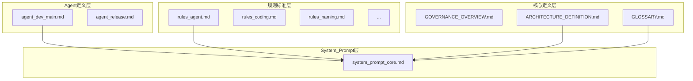

# ArchPilot Core - AI Prompt 策略指南

**文档版本**: v1.0.0  
**最后更新**: 2026-02-01  
**目的**: 指导如何将治理规则转化为 AI 工具的 System Prompt 和 User Prompt

---

## 1. 概述

### 1.1 目标

将 ArchPilot Core 的治理规则系统化地转化为 AI 的 Prompt，使 AI 在执行任务时：
- ✅ 有明确的规则约束
- ✅ 减少推理方向的发散和不确定性
- ✅ 保持输出的一致性和可预测性

### 1.2 Prompt 类型定义

| 类型 | 作用 | 特点 | 加载时机 |
|------|------|------|----------|
| **System Prompt** | 定义 AI 的角色、能力边界、行为约束 | 稳定不变、全局生效 | 会话开始时 |
| **User Prompt** | 提供具体任务上下文和参考信息 | 动态变化、任务相关 | 任务执行时 |

---

## 2. 文档分层与 Prompt 映射

### 2.1 分层策略图

```
┌─────────────────────────────────────────────────────────────────┐
│                    System Prompt（必须加载）                      │
│  ┌─────────────────────────────────────────────────────────┐   │
│  │  Layer 0: 核心身份与能力边界                              │   │
│  │  • agent_dev_main.md / agent_release.md（角色定义）       │   │
│  │  • rules_agent.md（变更保护规则）                         │   │
│  └─────────────────────────────────────────────────────────┘   │
│  ┌─────────────────────────────────────────────────────────┐   │
│  │  Layer 1: 核心定义（精简版）                              │   │
│  │  • ARCHITECTURE_DEFINITION.md（L1-L5 定义）              │   │
│  │  • GLOSSARY.md（关键术语）                                │   │
│  └─────────────────────────────────────────────────────────┘   │
├─────────────────────────────────────────────────────────────────┤
│                    User Prompt（按需加载）                       │
│  ┌─────────────────────────────────────────────────────────┐   │
│  │  Layer 2: 任务相关规则                                    │   │
│  │  • rules_coding.md（代码任务时）                          │   │
│  │  • rules_naming.md（创建文件时）                          │   │
│  │  • rules_release.md（发布任务时）                         │   │
│  │  • rules_scripts.md（脚本任务时）                         │   │
│  │  • rules_tag.md（创建 Tag 时）                            │   │
│  │  • rules_testcases.md（测试任务时）                       │   │
│  └─────────────────────────────────────────────────────────┘   │
│  ┌─────────────────────────────────────────────────────────┐   │
│  │  Layer 3: 检查清单与模板                                  │   │
│  │  • dev_checklist.md（开发检查时）                         │   │
│  │  • release_checklist.md（发布检查时）                     │   │
│  │  • templates/*（创建文档时）                              │   │
│  └─────────────────────────────────────────────────────────┘   │
└─────────────────────────────────────────────────────────────────┘
```

### 2.2 详细映射表

| 文档 | Prompt 类型 | 优先级 | 加载条件 | 说明 |
|------|------------|--------|----------|------|
| **agent_dev_main.md** | System | P0-必须 | 始终 | AI 角色定义和核心职责 |
| **agent_release.md** | System | P0-必须 | 发布场景 | 发布 Agent 角色定义 |
| **rules_agent.md** | System | P0-必须 | 始终 | 变更保护规则，决定能做什么 |
| **ARCHITECTURE_DEFINITION.md** | System | P1-核心 | 始终 | L1-L5 定义（可精简） |
| **GLOSSARY.md** | System | P1-核心 | 始终 | 关键术语（可精简） |
| **GOVERNANCE_OVERVIEW.md** | User | P2-参考 | 需要时 | 治理入口索引 |
| **rules_coding.md** | User | P2-任务 | 代码任务 | 编码规范 |
| **rules_naming.md** | User | P2-任务 | 文件创建 | 命名规范 |
| **rules_release.md** | User | P2-任务 | 发布任务 | 发布规则 |
| **rules_scripts.md** | User | P2-任务 | 脚本任务 | 脚本规范 |
| **rules_tag.md** | User | P2-任务 | Tag 创建 | Tag 规范 |
| **rules_testcases.md** | User | P2-任务 | 测试任务 | 测试用例规范 |
| **dev_checklist.md** | User | P3-检查 | 检查任务 | 开发检查清单 |
| **release_checklist.md** | User | P3-检查 | 发布检查 | 发布检查清单 |
| **templates/*** | User | P3-模板 | 创建文档 | 文档模板 |
| **AI_Development_Guide.md** | 参考文档 | P4-指南 | 复杂任务 | 提示词库 |
| **AI_Release_Automation_Guide.md** | 参考文档 | P4-指南 | 发布流程 | 发布指南 |

---

## 3. System Prompt 设计

### 3.1 核心 System Prompt 结构

```markdown
# System Prompt 结构

## Part 1: 角色定义（来自 agent_*.md）
你是 ArchPilot Core 架构设计 Agent，负责...

## Part 2: 能力边界（来自 rules_agent.md）
### 变更保护规则
- 受保护文件需人工确认后才能修改
- Governance/ 目录下文件默认受保护
...

## Part 3: 核心定义（来自 ARCHITECTURE_DEFINITION.md 精简版）
### L1-L5 架构定义
| 层级 | 名称 | 职责 | 前缀 |
|------|------|------|------|
| L1 | 需求层 | 定义做什么 | FR_ |
| L2 | 架构层 | 定义如何组织 | SA_ |
| L3 | 设计层 | 定义如何实现 | DD_ |
| L4 | 实现层 | 编码实现 | - |
| L5 | 验证层 | 测试验证 | TC- |

## Part 4: 关键术语（来自 GLOSSARY.md 精简版）
### 规则等级
- ✅ MUST: 必须遵守
- ⚠️ SHOULD: 建议遵守
- ⭕ MAY: 可选
- ❌ MUST NOT: 禁止

### 质量评级
- 优秀(≥4.5) | 良好(≥4.0) | 及格(≥3.0) | 不及格(<3.0)

## Part 5: 执行约束
1. 执行任务前必须识别任务类型
2. 根据任务类型加载对应规则
3. 受保护文件修改需输出理由并等待确认
4. 保持追溯关系完整性
```

### 3.2 System Prompt 精简原则

| 原则 | 说明 | 示例 |
|------|------|------|
| **只保留约束性内容** | 去除解释性文字 | 保留规则，去除背景说明 |
| **表格优于长文** | 结构化信息更易解析 | 用表格替代段落描述 |
| **合并重复内容** | 多文档相同内容只保留一份 | L1-L5 定义只出现一次 |
| **分级加载** | 核心规则始终加载，任务规则按需 | rules_agent 始终，rules_coding 按需 |

### 3.3 推荐的 System Prompt 模板

```markdown
# ArchPilot Core - 架构设计 Agent

## 角色
你是架构设计引导 Agent，负责在规则约束下执行架构设计相关任务。

## 核心约束

### 1. 变更保护（MUST）
- Governance/ 目录文件受保护，修改需人工确认
- 受保护文件头部有 "⚠️ AI 变更保护声明"
- 修改前必须输出变更理由

### 2. L1-L5 架构（MUST）
| 层级 | 职责 | 目录 | 前缀 |
|------|------|------|------|
| L1 | 需求定义 | L1_Requirements/ | FR_ |
| L2 | 架构设计 | L2_Architecture/ | SA_ |
| L3 | 详细设计 | L3_DetailDesign/ | DD_ |
| L4 | 代码实现 | L4_Implementation/ | - |
| L5 | 测试验证 | L5_Verification/ | TC- |

### 3. 追溯关系（MUST）
- 下层文档必须通过 traces_from 追溯到上层
- 创建文档时必须建立正确的追溯关系

### 4. 术语规范（SHOULD）
- 规则等级：✅MUST | ⚠️SHOULD | ⭕MAY | ❌MUST NOT
- 质量评级：优秀(≥4.5) | 良好(≥4.0) | 及格(≥3.0) | 不及格(<3.0)

## 执行流程
1. 识别任务类型（文档/代码/脚本/测试/发布）
2. 检查是否涉及受保护文件
3. 加载任务相关规则（通过 User Prompt 提供）
4. 在规则约束下执行任务
5. 验证追溯关系完整性
6. 输出规则遵守情况

## 响应格式
任务完成后必须输出：
- 规则遵守情况总结
- 追溯关系更新说明
- 文件变更清单
```

---

## 4. User Prompt 设计

### 4.1 任务类型与规则映射

| 任务类型 | 需加载的规则文档 | 需加载的模板 |
|----------|-----------------|-------------|
| 创建需求文档 | rules_naming.md | tpl_requirement.md |
| 创建架构文档 | rules_naming.md | tpl_architecture.md |
| 创建设计文档 | rules_naming.md | tpl_design.md |
| 编写代码 | rules_coding.md, rules_naming.md | - |
| 编写脚本 | rules_scripts.md | - |
| 编写测试 | rules_testcases.md | tpl_testcase.md |
| 版本发布 | rules_release.md, rules_tag.md | tpl_release_notes.md |
| 质量检查 | dev_checklist.md | - |
| 发布检查 | release_checklist.md | - |

### 4.2 User Prompt 模板

```markdown
# 任务上下文

## 任务类型
[创建需求文档 / 编写代码 / 版本发布 / ...]

## 相关规则
[根据任务类型插入对应的规则文档内容]

## 相关模板
[根据任务类型插入对应的模板内容]

## 具体任务
[用户的具体任务描述]
```

---

## 5. 依赖关系与加载顺序

### 5.1 文档依赖链

```
System Prompt 依赖链：
agent_dev_main.md
    └── rules_agent.md
    └── ARCHITECTURE_DEFINITION.md（精简）
    └── GLOSSARY.md（精简）

User Prompt 依赖链（示例：创建需求文档）：
rules_naming.md
    └── ARCHITECTURE_DEFINITION.md（已在 System）
    └── GLOSSARY.md（已在 System）
tpl_requirement.md
```

### 5.2 加载顺序

```
1. [会话开始] 加载 System Prompt
   ├── 角色定义
   ├── 变更保护规则
   ├── L1-L5 定义
   └── 关键术语

2. [任务开始] 识别任务类型

3. [按需加载] 加载 User Prompt
   ├── 任务相关规则
   └── 任务相关模板

4. [执行任务] 在约束下执行

5. [任务完成] 输出规则遵守情况
```

---

## 6. 实施建议

### 6.1 分阶段实施

| 阶段 | 内容 | 产出 |
|------|------|------|
| Phase 1 | 生成精简版 System Prompt | `system_prompt_core.md` |
| Phase 2 | 为每类任务生成 User Prompt 模板 | `user_prompt_*.md` |
| Phase 3 | 集成到 AI 工具配置 | 工具配置文件 |
| Phase 4 | 测试与迭代优化 | 优化后的 Prompt |

### 6.2 需要新增的文件

| 文件 | 用途 |
|------|------|
| `Prompts/system_prompt_core.md` | 核心 System Prompt |
| `Prompts/system_prompt_release.md` | 发布场景 System Prompt |
| `Prompts/user_prompt_document.md` | 文档任务 User Prompt 模板 |
| `Prompts/user_prompt_code.md` | 代码任务 User Prompt 模板 |
| `Prompts/user_prompt_release.md` | 发布任务 User Prompt 模板 |

### 6.3 Token 优化建议

| 策略 | 效果 |
|------|------|
| 表格替代段落 | 减少 30-50% Token |
| 去除重复定义 | 减少 20-30% Token |
| 分级加载 | 按需使用 Token |
| 使用引用而非复制 | 避免重复内容 |

---

## 7. 更新后的文档依赖图

建议在 `DOCUMENT_DEPENDENCY.mmd` 中新增 Prompt 层：



---

## 8. 总结

### 8.1 核心结论

| 类型 | 包含文档 | 特点 |
|------|----------|------|
| **System Prompt** | agent_*.md + rules_agent.md + ARCHITECTURE_DEFINITION(精简) + GLOSSARY(精简) | 约 2000-3000 tokens，始终加载 |
| **User Prompt** | 任务相关的 rules_*.md + templates/* | 约 500-2000 tokens/任务，按需加载 |
| **参考文档** | AI_*_Guide.md, GOVERNANCE_OVERVIEW.md | 不直接作为 Prompt，供查阅 |

### 8.2 下一步行动

1. ✅ 创建 `Prompts/` 目录
2. ✅ 生成精简版 System Prompt
3. ✅ 为主要任务类型生成 User Prompt 模板
4. ⬜ 测试 Prompt 效果
5. ⬜ 迭代优化

---

## 关联文档

- [文档依赖图](DOCUMENT_DEPENDENCY.mmd)
- [Agent 定义](../Agents/)
- [规则文件](rules/)

