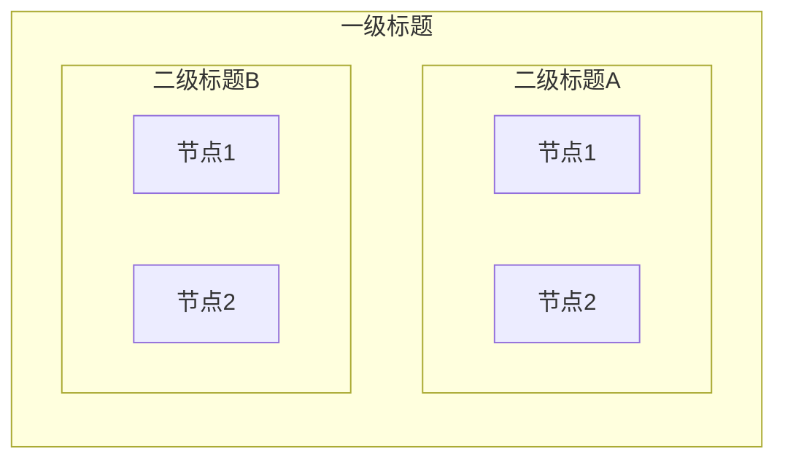
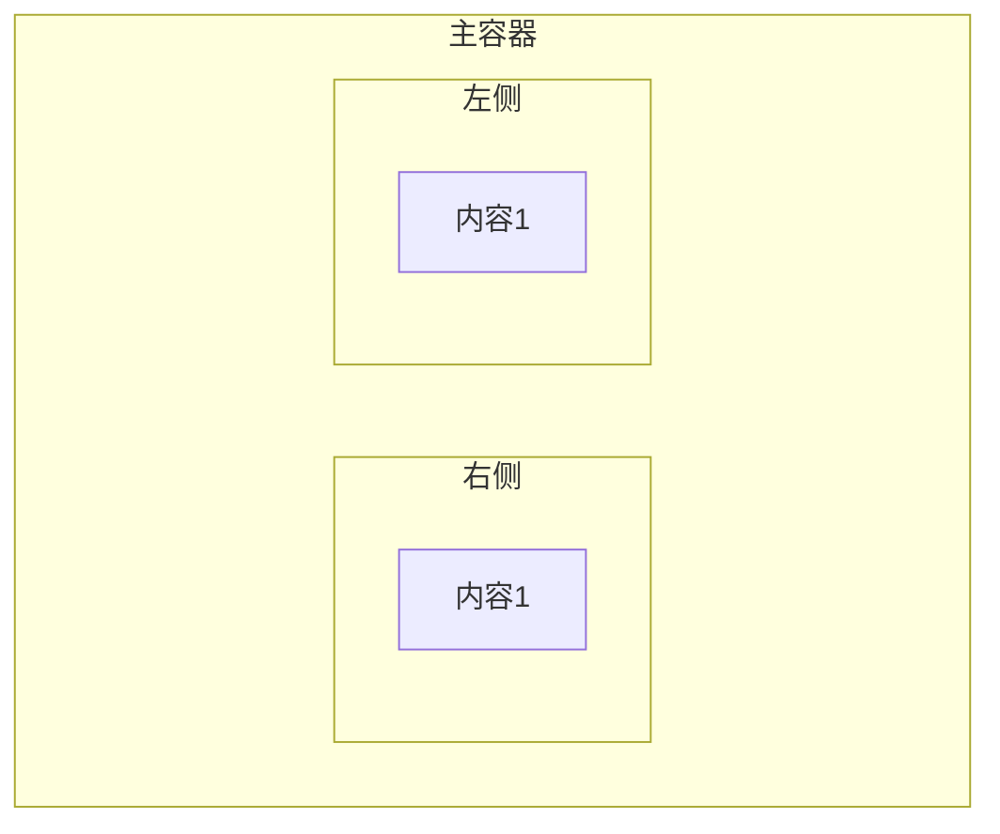
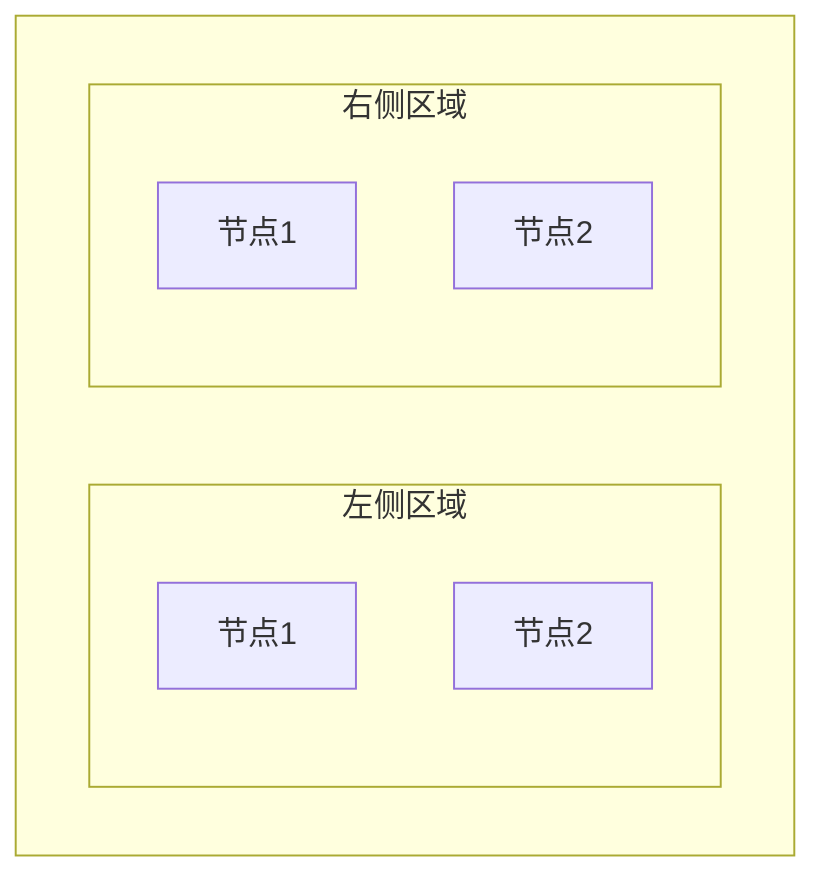
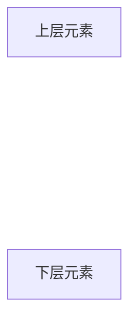
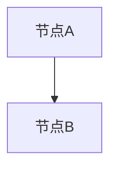
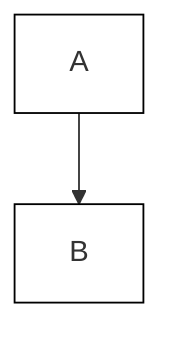
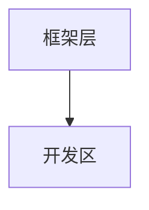
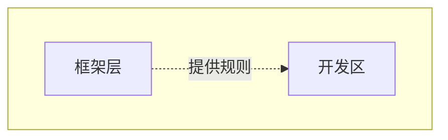

# Mermaid 图表规范

**文档版本**: v1.0.0  
**最后更新**: 2026-02-01  
**适用范围**: ArchPilot Core 项目中的所有 Mermaid 图表

---

## 1. 概述

本文档定义 Mermaid 图表的配色、布局和最佳实践规范，确保所有图表风格统一、清晰易读。

---

## 2. 配色规范

### 2.1 容器框统一背景色

**重要原则**：所有大框（subgraph 容器）使用统一的浅灰色背景，避免颜色语言过于杂乱。

| 用途 | 背景色 | 边框色 | 文字色 | 边框宽度 |
|------|--------|--------|--------|----------|
| **容器框（统一）** | `#fafafa` 浅灰 | `#424242` 深灰 | `#000` 黑色 | 2px |
| **步骤节点** | `#ffffff` 白色 | `#424242` 深灰 | `#000` 黑色 | 2px |
| **连线** | - | `#333333` 黑色 | - | 2px |

```mermaid
%% 容器框和步骤节点样式（必须统一使用）
classDef frameStyle fill:#fafafa,stroke:#424242,stroke-width:2px,color:#000
classDef stepStyle fill:#fff,stroke:#424242,stroke-width:2px,color:#000

%% 连线样式（黑色，易于观察）
linkStyle default stroke:#333,stroke-width:2px
```

### 2.2 文档/过程产物颜色

颜色**仅用于文档节点**，区分不同类型的过程产物。

#### Core 文件（低饱和度冷色调）

用于框架内稳定、低频变更的文件：

| 文档类型 | 背景色 | 边框色 | 色系 | 示例 |
|----------|--------|--------|------|------|
| **Entry 入口** | `#eceff1` 蓝灰 | `#607d8b` 灰蓝 | 冷灰 | README.md, QUICK_START.md |
| **Rules 规则** | `#e8eaf6` 靛蓝浅 | `#5c6bc0` 靛蓝 | 冷蓝 | rules_*.md |
| **Workflow 工作流** | `#e0f2f1` 青绿浅 | `#26a69a` 青绿 | 冷青 | flow_*.md |
| **Templates 模板** | `#e3f2fd` 蓝浅 | `#42a5f5` 蓝 | 冷蓝 | *_template.md |
| **Scripts 脚本** | `#ede7f6` 紫浅 | `#7e57c2` 紫 | 冷紫 | *.py, *.sh |

```mermaid
%% Core 文件颜色（低饱和度冷色调）
classDef entryStyle fill:#eceff1,stroke:#607d8b,stroke-width:2px,color:#000
classDef ruleStyle fill:#e8eaf6,stroke:#5c6bc0,stroke-width:2px,color:#000
classDef workflowStyle fill:#e0f2f1,stroke:#26a69a,stroke-width:2px,color:#000
classDef tplStyle fill:#e3f2fd,stroke:#42a5f5,stroke-width:2px,color:#000
classDef scriptStyle fill:#ede7f6,stroke:#7e57c2,stroke-width:2px,color:#000
```

#### 过程产物（高饱和度暖色调）

用于具体项目输出、高频变更的文件：

| 文档类型 | 背景色 | 边框色 | 色系 | 示例 |
|----------|--------|--------|------|------|
| **Output 产出** | `#fff3e0` 橙浅 | `#ff9800` 橙 | 暖橙 | FR_*.md, SA_*.md, DD_*.md |
| **Output 高亮** | `#ffccbc` 深橙浅 | `#ff5722` 深橙 | 暖红橙 | 代码文件, TC-*.md |

```mermaid
%% 过程产物颜色（高饱和度暖色调）
classDef outputStyle fill:#fff3e0,stroke:#ff9800,stroke-width:2px,color:#000
classDef outputHighStyle fill:#ffccbc,stroke:#ff5722,stroke-width:2px,color:#000
```

### 2.3 配色原则

1. **容器框统一**：所有 subgraph 使用相同的浅灰背景 `#fafafa`
2. **颜色仅用于文档**：彩色仅用于标识文档/过程产物类型
3. **冷暖色调区分**：
   - **冷色调（低饱和）**→ Core 文件：稳定、低频变更、框架层
   - **暖色调（高饱和）**→ 过程产物：项目输出、高频变更、业务层
4. **高对比度**：背景色浅，边框色深，确保清晰可见
5. **文字黑色**：始终使用 `color:#000`，确保可读性
6. **语义化配色**：
   - 灰蓝系 → 入口文档（稳定起点）
   - 靛蓝系 → 规则文档（约束）
   - 青绿系 → 工作流文档（流程）
   - 蓝色系 → 模板文档（指导）
   - 紫色系 → 脚本工具（自动化）
   - 橙色系 → 产出文档（结果/变更）

### 2.4 旧版色板（已废弃）

以下色板仅供参考，新图表请使用 2.1 和 2.2 的规范：

| 用途 | 背景色 | 边框色 | 文字色 | 边框宽度 |
|------|--------|--------|--------|----------|
| **核心框架** | `#bbdefb` 浅蓝 | `#1565c0` 深蓝 | `#000` 黑色 | 3px |
| **部署/操作** | `#ffe0b2` 浅橙 | `#ef6c00` 深橙 | `#000` 黑色 | 3px |
| **项目/产出** | `#c8e6c9` 浅绿 | `#2e7d32` 深绿 | `#000` 黑色 | 3px |
| **工作流/流程** | `#e1bee7` 浅紫 | `#6a1b9a` 深紫 | `#000` 黑色 | 3px |
| **框架层** | `#fff9c4` 浅黄 | `#f57f17` 金色 | `#000` 黑色 | 2px |
| **定制区** | `#b2dfdb` 青绿 | `#00695c` 深青 | `#000` 黑色 | 2px |
| **架构阶段** | `#e8eaf6` 靛蓝浅 | `#3f51b5` 靛蓝 | `#000` 黑色 | 2px |
| **实现阶段** | `#fce4ec` 粉红浅 | `#c2185b` 粉红深 | `#000` 黑色 | 2px |

---

## 3. 布局规范

### 3.1 流程图方向

| 图表类型 | 推荐方向 | 说明 |
|----------|----------|------|
| 顶层流程 | `TB` (Top to Bottom) | 从上到下，符合阅读习惯 |
| 并列关系 | `LR` (Left to Right) | 从左到右，强调平等关系 |
| 时间序列 | `LR` | 从左到右，表示时间推进 |
| 层次结构 | `TB` | 从上到下，表示层级关系 |

### 3.2 子图嵌套规则



**规则**：
- 外层子图控制整体方向
- 内层子图可以独立设置方向
- 并列的子图使用相同的方向
- 最多嵌套 3 层（可读性考虑）

### 3.3 节点命名规范

| 节点类型 | ID 格式 | 示例 |
|----------|---------|------|
| 普通节点 | `区域_功能` | `C_GOV`, `P_L1` |
| 分组容器 | `区域_类型` | `P_CORE`, `W_ARCH` |
| 不可见节点 | `区域_位置` | `P_TOP`, `P_BOT` |

---

## 4. 布局 Tricks

### 4.1 不可见节点对齐

**用途**：控制子图间的对齐和间距



**要点**：
- 使用空格作为节点文本 `[" "]`
- 应用不可见样式 `fill:none,stroke:none,color:transparent`
- 使用虚线连接 `~~~` 不显示箭头

### 4.2 并列布局强制

**用途**：强制两个子图在同一行显示



**要点**：
- 外层容器使用 `direction LR`
- 内层子图使用 `direction TB`
- 容器标题可以为空格 `[" "]` 隐藏标题

### 4.3 垂直间距控制

**用途**：调整上下元素的间距



**要点**：
- 使用多个不可见节点增加间距
- 节点数量 = 期望的间距倍数

### 4.4 连接线类型

| 线型 | 语法 | 用途 |
|------|------|------|
| 实线箭头 | `A --> B` | 主要流程、强依赖 |
| 虚线箭头 | `A -.-> B` | 次要关系、弱依赖、复制关系 |
| 实线无箭头 | `A --- B` | 平等关系 |
| 虚线无箭头 | `A ~~~ B` | 不可见连接、布局辅助 |
| 带标签 | `A -->|标签| B` | 说明关系类型 |

---

## 5. 最佳实践

### 5.1 图表复杂度控制

| 层级 | 最大节点数 | 最大子图数 | 建议 |
|------|-----------|-----------|------|
| 简单 | ≤10 | ≤3 | 单一主题，一目了然 |
| 中等 | 11-20 | 4-6 | 适当分组，层次清晰 |
| 复杂 | 21-30 | 7-9 | 考虑拆分为多个图表 |
| 过度 | >30 | >9 | 必须拆分，否则难以阅读 |

### 5.2 文本内容规范

```mermaid
%% 好的例子
A["简短标题<br/>补充说明"]

%% 不好的例子
B["非常非常长的标题文本会导致节点过宽影响布局"]
```

**规则**：
- 单行文本 ≤20 字符
- 使用 `<br/>` 换行拆分长文本
- 重要信息在第一行
- 补充信息在第二行

### 5.3 注释规范



**规则**：
- 文件开头必须有标题注释
- 使用分隔线 `%%` + `=` 标识主要段落
- 复杂逻辑前添加注释说明
- 样式定义前添加说明

### 5.4 样式应用顺序



**规则**：
- 样式定义在图表结构之后
- 样式应用在文件末尾
- 单个样式可应用多个节点

---

## 6. 示例对比

### 6.1 布局优化前后

❌ **优化前**：上下排列，层次不清



✅ **优化后**：左右并列，关系明确



### 6.2 配色优化前后

❌ **优化前**：对比度低，不易识别

```mermaid
classDef oldStyle fill:#e1f5fe,stroke:#01579b
```

✅ **优化后**：高对比度，清晰可见

```mermaid
classDef newStyle fill:#bbdefb,stroke:#1565c0,stroke-width:3px,color:#000
```

---

## 7. 工具与环境

### 7.1 推荐工具

| 工具 | 用途 | 优势 |
|------|------|------|
| **VS Code + Mermaid 插件** | 编辑预览 | 实时渲染，快速迭代 |
| **Mermaid Live Editor** | 在线编辑 | 无需安装，分享便捷 |
| **GitHub** | 版本控制 | 原生支持，自动渲染 |

### 7.2 在线资源

- **Mermaid 官方文档**: https://mermaid.js.org/
- **Live Editor**: https://mermaid.live/
- **Material Design 配色**: https://materialui.co/colors

---

## 8. 检查清单

### 图表质量检查

- [ ] 配色符合规范（高对比度、黑色文字）
- [ ] 布局合理（并列关系用 LR，层次关系用 TB）
- [ ] 节点数量适中（≤30 个）
- [ ] 文本简洁（单行 ≤20 字符）
- [ ] 注释完整（标题、分段说明）
- [ ] 样式应用正确（在文件末尾）
- [ ] 连接线类型恰当（实线/虚线）
- [ ] 在多个环境中测试渲染效果

---

## 9. 常见问题

### Q1: 子图并列显示失败？

**A**: 确保外层容器使用 `direction LR`，内层子图独立控制方向。

### Q2: 样式不生效？

**A**: 样式应用必须在文件末尾，且节点 ID 必须匹配。

### Q3: 图表在 GitHub 上显示不正常？

**A**: GitHub 对 Mermaid 版本有限制，避免使用最新语法特性。

### Q4: 如何隐藏子图标题？

**A**: 使用空格作为标题 `subgraph Container[" "]`。

---

## 10. 关联文档

- [DEPLOYMENT_FLOW.mmd](DEPLOYMENT_FLOW.mmd) - 部署流程图示例
- [DOCUMENT_DEPENDENCY.mmd](DOCUMENT_DEPENDENCY.mmd) - 文档依赖图示例

