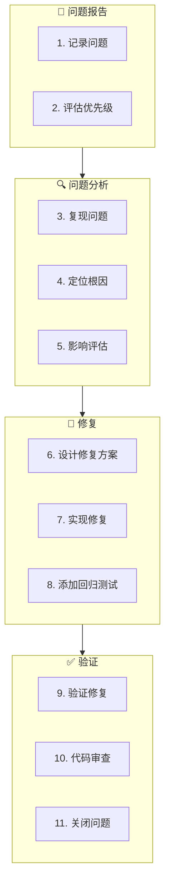

# 问题修复工作流（Bugfix Workflow）

**工作流ID**: flow_bugfix  
**类型**: 临时工作流（Ad-hoc）  
**触发条件**: Bug 发现  
**紧急度**: 中

---

## 1. 工作流概述

问题修复工作流用于处理开发或测试过程中发现的 Bug，确保问题被正确分析、修复和验证。

### 1.1 目标

- 快速定位问题根因
- 正确修复问题
- 验证修复有效性
- 防止回归

### 1.2 参与角色

| 角色 | 职责 |
|------|------|
| 报告者 | 报告问题、验证修复 |
| 开发者 | 分析原因、实现修复 |
| AI Agent | 辅助分析、代码审查 |

---

## 2. 工作流步骤



---

## 3. 详细步骤说明

### 3.1 记录问题

**目的**: 清晰记录问题信息

**Bug 报告模板**:
```markdown
## Bug 报告

**Bug ID**: BUG-001
**标题**: 用户登录失败无错误提示
**报告人**: xxx
**报告日期**: 2026-02-01
**优先级**: P2 (High)

### 环境信息
- 系统版本: v0.1.0
- 操作系统: Linux
- 其他: 

### 问题描述
当用户输入错误密码时，登录失败但没有任何错误提示。

### 复现步骤
1. 打开登录页面
2. 输入正确用户名
3. 输入错误密码
4. 点击登录

### 预期行为
显示"密码错误"提示

### 实际行为
页面无任何响应

### 相关信息
- 日志截图: [附件]
- 关联需求: FR_core_001
```

---

### 3.2 评估优先级

**优先级定义**:

| 优先级 | 说明 | 处理时限 |
|--------|------|----------|
| P0 | 阻塞性，系统不可用 | 立即处理 |
| P1 | 严重，核心功能不可用 | 24小时内 |
| P2 | 重要，影响用户体验 | 本Sprint |
| P3 | 一般，小问题 | 下个Sprint |
| P4 | 低，优化建议 | 待定 |

---

### 3.3 复现问题

**目的**: 确认问题可复现

**执行动作**:
1. 按报告的步骤操作
2. 确认问题存在
3. 记录复现环境
4. 收集日志信息

**AI 介入点**:
```
提示词：
"分析以下日志，帮助定位问题原因：
[日志内容]
问题描述：登录失败无错误提示"
```

---

### 3.4 定位根因

**目的**: 找到问题的根本原因

**分析方法**:
1. 代码审查
2. 日志分析
3. 调试追踪
4. 对比正常流程

**根因记录**:
```markdown
### 根因分析

**根因**: 错误处理代码中缺少对密码验证失败的提示逻辑

**代码位置**: 
- 文件: login_handler.cpp
- 函数: validateCredentials()
- 行号: 125

**原因说明**:
在密码验证失败时，代码只返回了 false，但没有设置错误消息。

**关联设计**: DD_core_001 Section 5.1 (错误处理)
```

---

### 3.5 影响评估

**评估内容**:
- [ ] 影响范围（哪些功能受影响）
- [ ] 影响用户数（多少用户受影响）
- [ ] 数据影响（是否有数据问题）
- [ ] 安全影响（是否有安全风险）

---

### 3.6 设计修复方案

**目的**: 设计正确的修复方案

**修复方案记录**:
```markdown
### 修复方案

**方案描述**: 
在密码验证失败时，添加错误消息设置。

**修改内容**:
1. 在 validateCredentials() 返回 false 前，调用 setErrorMessage("密码错误")
2. 在前端添加错误消息显示逻辑

**影响评估**:
- 修改文件: login_handler.cpp, login.js
- 风险: 低
- 回归风险: 需测试正常登录流程
```

---

### 3.7 实现修复

**执行动作**:
1. 创建修复分支（如需要）
2. 实现修复代码
3. 添加追溯注释

**追溯注释**:
```cpp
// Fix: BUG-001 - 添加密码错误提示
// Ref: DD_core_001.5.1
if (!isPasswordValid) {
    setErrorMessage("密码错误");
    return false;
}
```

---

### 3.8 添加回归测试

**目的**: 防止问题再次出现

**回归测试命名**:
```
TC-[子系统]-[编号]-regression-[bug-id].md
示例: TC-core-015-regression-bug-001.md
```

**测试用例**:
```markdown
## TC-core-015-regression-bug-001

**测试目的**: 验证 BUG-001 修复有效
**关联Bug**: BUG-001

### 测试步骤
1. 打开登录页面
2. 输入正确用户名
3. 输入错误密码
4. 点击登录

### 预期结果
显示"密码错误"提示

### 测试结果
- [ ] 通过
- [ ] 失败
```

---

### 3.9 验证修复

**验证内容**:
- [ ] Bug 已修复（问题不再出现）
- [ ] 回归测试通过
- [ ] 相关功能正常
- [ ] 无新问题引入

---

### 3.10 代码审查

**Review 关注点**:
- [ ] 修复是否正确
- [ ] 是否有副作用
- [ ] 追溯注释是否完整
- [ ] 回归测试是否充分

---

### 3.11 关闭问题

**关闭信息**:
```markdown
### Bug 关闭

**关闭日期**: 2026-02-01
**修复版本**: v0.1.1
**修复人**: xxx
**验证人**: xxx

**关联提交**: abc123
**回归测试**: TC-core-015-regression-bug-001
```

---

## 4. 产出物清单

| 产出物 | 存放位置 | 说明 |
|--------|----------|------|
| Bug 报告 | `Progress/bugs/` | 问题记录 |
| 修复代码 | `L4_Implementation/` | 含 Bug ID 注释 |
| 回归测试 | `L5_Verification/regression/` | 防止回归 |

---

## 5. 关联工作流

- **上游**: [实现工作流](flow_implement.md)（Bug 来源）
- **下游**: [发布工作流](flow_release.md)（包含修复）
- **升级**: [紧急发布工作流](flow_hotfix.md)（P0/P1 Bug）

---

## 6. 变更历史

| 版本 | 日期 | 变更内容 |
|------|------|----------|
| v1.0.0 | 2026-02-01 | 初始版本 |

