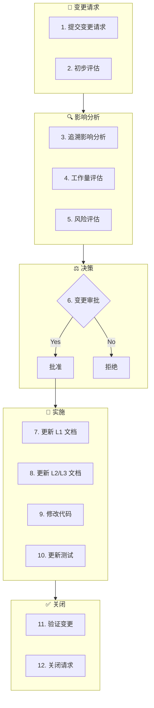

# 需求变更工作流（Change Workflow）

**工作流ID**: flow_change  
**类型**: 临时工作流（Ad-hoc）  
**触发条件**: 需求变更请求  
**紧急度**: 中

---

## 1. 工作流概述

需求变更工作流用于处理项目进行中的需求变更，确保变更被正确评估、实施和追溯。

### 1.1 目标

- 评估变更影响
- 更新相关文档
- 保持追溯完整性
- 控制变更风险

### 1.2 参与角色

| 角色 | 职责 |
|------|------|
| 需求方 | 提出变更请求 |
| 项目负责人 | 评估和批准变更 |
| 开发者 | 评估技术影响、实施变更 |
| AI Agent | 追溯分析、影响评估 |

---

## 2. 工作流步骤



---

## 3. 详细步骤说明

### 3.1 提交变更请求

**目的**: 正式记录变更需求

**变更请求模板**:
```markdown
## 需求变更请求

**变更ID**: CR-001
**标题**: 增加密码复杂度校验
**请求人**: xxx
**请求日期**: 2026-02-01
**优先级**: P2

### 变更描述
在用户注册和修改密码时，增加密码复杂度校验。

### 变更原因
安全要求，防止弱密码

### 期望实现时间
Sprint 1.3

### 关联需求
- 原需求: FR_core_001 用户认证
- 新增/修改: 新增密码复杂度校验功能
```

---

### 3.2 初步评估

**评估内容**:
- [ ] 变更是否合理
- [ ] 是否在项目范围内
- [ ] 是否与现有需求冲突

**初步评估结果**:
- ✅ 接受评估 → 进入影响分析
- ❌ 拒绝 → 说明原因，关闭请求

---

### 3.3 追溯影响分析

**目的**: 分析变更对现有文档和代码的影响

**AI 介入点**:
```
提示词：
"分析以下需求变更对 L1-L5 的影响：
变更内容: 增加密码复杂度校验

请检查:
1. 需要修改的 FR 文档
2. 需要修改的 SA/DD 文档
3. 需要修改的代码文件
4. 需要修改的测试用例"
```

**影响分析报告**:
```markdown
### 追溯影响分析

**变更**: CR-001 增加密码复杂度校验

#### 影响的 L1 文档
| 文档ID | 影响类型 | 说明 |
|--------|----------|------|
| FR_core_001 | 修改 | 增加密码复杂度要求 |

#### 影响的 L2/L3 文档
| 文档ID | 影响类型 | 说明 |
|--------|----------|------|
| SA_core_001 | 修改 | 增加校验组件 |
| DD_core_001 | 修改 | 增加校验算法设计 |
| DD_core_003 | 新增 | 密码校验模块设计 |

#### 影响的 L4 代码
| 文件 | 影响类型 | 说明 |
|------|----------|------|
| password_validator.cpp | 新增 | 密码校验实现 |
| login_handler.cpp | 修改 | 调用校验 |

#### 影响的 L5 测试
| 用例ID | 影响类型 | 说明 |
|--------|----------|------|
| TC-core-020 | 新增 | 密码复杂度测试 |
```

---

### 3.4 工作量评估

**评估维度**:

| 维度 | 工作量 | 说明 |
|------|--------|------|
| L1 文档 | 0.5d | 修改1个文档 |
| L2/L3 文档 | 1d | 修改2个，新增1个 |
| L4 代码 | 2d | 新增1个模块，修改1个 |
| L5 测试 | 1d | 新增测试用例 |
| **总计** | 4.5d | |

---

### 3.5 风险评估

**风险评估**:

| 风险 | 可能性 | 影响 | 缓解措施 |
|------|--------|------|----------|
| 兼容性问题 | 中 | 中 | 向后兼容设计 |
| 进度延迟 | 低 | 高 | 预留 Buffer |
| 回归问题 | 低 | 中 | 完整回归测试 |

---

### 3.6 变更审批

**审批决策**:
| 决策 | 条件 |
|------|------|
| ✅ 批准 | 影响可控，资源可用 |
| ⚠️ 延期 | 当前阶段无资源 |
| ❌ 拒绝 | 影响过大或不合理 |

**审批记录**:
```markdown
### 变更审批

**变更ID**: CR-001
**审批人**: xxx
**审批日期**: 2026-02-01
**决策**: ✅ 批准

**条件/备注**:
在 Sprint 1.3 实施，需完成回归测试

**计划实施时间**: Sprint 1.3
**分配人员**: developer1
```

---

### 3.7 更新 L1 文档

**执行动作**:
1. 修改受影响的 FR 文档
2. 更新版本号
3. 添加变更历史

**变更追踪**:
```yaml
---
# FR_core_001 更新后的元数据
version: v1.1.0
updated: 2026-02-01
change_request: CR-001
---
```

**变更历史**:
```markdown
## 变更历史

| 版本 | 日期 | 变更内容 | 关联CR |
|------|------|----------|--------|
| v1.1.0 | 2026-02-01 | 增加密码复杂度要求 | CR-001 |
| v1.0.0 | 2026-01-15 | 初始版本 | - |
```

---

### 3.8 更新 L2/L3 文档

**执行动作**:
1. 修改受影响的 SA/DD 文档
2. 新增必要的文档
3. 更新追溯关系

**追溯更新**:
```yaml
# DD_core_003 (新增)
traces_from: [SA_core_001]
related_cr: CR-001
```

---

### 3.9 修改代码

**执行动作**:
1. 按更新后的设计实现
2. 添加变更追溯注释
3. 保持追溯完整

**追溯注释**:
```cpp
/**
 * @brief 密码复杂度校验
 * @design DD_core_003
 * @change CR-001 - 新增密码复杂度校验
 */
bool validatePasswordComplexity(const string& password);
```

---

### 3.10 更新测试

**执行动作**:
1. 修改受影响的测试用例
2. 新增必要的测试
3. 执行回归测试

---

### 3.11 验证变更

**验证内容**:
- [ ] 变更功能正确实现
- [ ] 所有受影响的测试通过
- [ ] 追溯关系完整
- [ ] 文档与代码一致

---

### 3.12 关闭请求

**关闭信息**:
```markdown
### 变更请求关闭

**变更ID**: CR-001
**关闭日期**: 2026-02-05
**实际工作量**: 5d
**实施版本**: v0.1.1

**变更摘要**:
- 修改文档: FR_core_001, SA_core_001, DD_core_001
- 新增文档: DD_core_003
- 新增代码: password_validator.cpp
- 新增测试: TC-core-020

**验证人**: xxx
```

---

## 4. 产出物清单

| 产出物 | 存放位置 | 说明 |
|--------|----------|------|
| 变更请求 | `Progress/changes/` | 变更记录 |
| 影响分析 | `Progress/changes/` | 影响评估 |
| 更新的文档 | `L1/L2/L3/` | 含变更版本 |
| 更新的代码 | `L4_Implementation/` | 含CR追溯 |
| 新增测试 | `L5_Verification/` | 变更验证 |

---

## 5. 关联工作流

- **触发**: [设计工作流](flow_design.md) / [实现工作流](flow_implement.md)
- **下游**: [实现工作流](flow_implement.md)
- **集成**: [发布工作流](flow_release.md)

---

## 6. 变更历史

| 版本 | 日期 | 变更内容 |
|------|------|----------|
| v1.0.0 | 2026-02-01 | 初始版本 |

