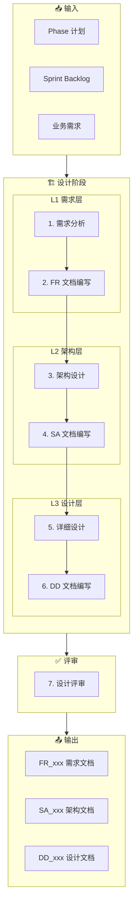

# 设计工作流（Design Workflow）

**工作流ID**: flow_design  
**类型**: 例行工作流（Routine）  
**触发条件**: 需求确定后  
**周期**: 迭代级

---

## 1. 工作流概述

设计工作流负责将需求转化为可实现的技术方案，产出 L1-L3 层级文档。

### 1.1 目标

- 将业务需求转化为功能需求（L1）
- 设计系统架构（L2）
- 完成详细设计（L3）
- 建立追溯关系

### 1.2 参与角色

| 角色 | 职责 |
|------|------|
| 架构师 | 审核架构设计、技术决策 |
| 开发者 | 详细设计、评审 |
| AI Agent | 文档生成、追溯维护 |

---

## 2. 工作流步骤



---

## 3. 详细步骤说明

### 3.1 需求分析（L1 准备）

**目的**: 深入理解业务需求，为 FR 文档做准备

**输入**:
- Sprint Backlog
- 原始业务需求

**执行动作**:
1. 分析用户故事/需求
2. 识别功能点
3. 定义验收条件
4. 确定范围边界

**AI 介入点**:
```
提示词：
"分析以下用户故事，提取功能需求点和验收条件：
[用户故事描述]"
```

**输出**:
- 需求分析笔记
- 功能点清单

---

### 3.2 FR 文档编写（L1）

**目的**: 编写正式的功能需求文档

**输入**:
- 需求分析结果
- FR 文档模板

**命名规范**:
```
FR_[子系统]_[编号]_[描述].md
示例: FR_core_001_user_authentication.md
```

**执行动作**:
1. 使用模板创建文档
2. 填写需求概述
3. 定义功能列表
4. 编写验收条件
5. 建立追溯元数据

**AI 介入点**:
```
提示词：
"基于以下需求分析，使用 FR 模板生成需求文档：
[需求分析内容]
遵循规则: archpilot/Governance/rules/rules_naming.md"
```

**文档结构**:
```yaml
---
id: FR_core_001
layer: L1
type: requirement
status: draft
traces_from: []
traces_to: []
---
# FR_core_001 用户认证

## 1. 需求概述
## 2. 功能需求
## 3. 非功能需求
## 4. 验收条件
## 5. 追溯关系
```

**检查点**:
- [ ] 命名符合规范
- [ ] 元数据完整
- [ ] 功能描述清晰
- [ ] 验收条件可测试

---

### 3.3 架构设计（L2 准备）

**目的**: 设计系统架构方案

**输入**:
- FR 文档
- 技术约束
- 子系统定义

**执行动作**:
1. 设计组件结构
2. 定义接口
3. 规划数据流
4. 做出架构决策

**AI 介入点**:
```
提示词：
"基于 FR_core_001 的需求，设计架构方案：
- 组件划分
- 接口定义
- 关键决策"
```

**输出**:
- 架构草图
- 组件清单
- 接口定义

---

### 3.4 SA 文档编写（L2）

**目的**: 编写正式的架构设计文档

**命名规范**:
```
SA_[子系统]_[编号]_[描述].md
示例: SA_core_001_auth_architecture.md
```

**执行动作**:
1. 使用模板创建文档
2. 绘制架构图
3. 描述组件职责
4. 定义接口规范
5. **建立追溯到 L1**

**追溯设置**:
```yaml
traces_from: [FR_core_001]
traces_to: []
```

**文档结构**:
```yaml
---
id: SA_core_001
layer: L2
type: architecture
traces_from: [FR_core_001]
---
# SA_core_001 认证架构设计

## 1. 概述
## 2. 架构视图
## 3. 组件设计
## 4. 接口设计
## 5. 架构决策记录
## 6. 追溯关系
```

**检查点**:
- [ ] traces_from 正确指向 FR
- [ ] 架构图清晰
- [ ] 接口定义完整
- [ ] 决策有记录

---

### 3.5 详细设计（L3 准备）

**目的**: 为实现做详细的技术设计

**输入**:
- SA 文档
- 技术选型

**执行动作**:
1. 设计类/模块结构
2. 定义数据结构
3. 设计算法逻辑
4. 规划错误处理

**AI 介入点**:
```
提示词：
"基于 SA_core_001 的架构，设计详细实现方案：
- 类设计
- 数据结构
- 关键算法"
```

---

### 3.6 DD 文档编写（L3）

**目的**: 编写详细设计文档

**命名规范**:
```
DD_[子系统]_[编号]_[描述].md
示例: DD_core_001_login_module.md
```

**执行动作**:
1. 使用模板创建文档
2. 描述类/模块设计
3. 定义数据结构
4. 编写算法伪代码
5. **建立追溯到 L2**

**追溯设置**:
```yaml
traces_from: [SA_core_001]
traces_to: []
```

**文档结构**:
```yaml
---
id: DD_core_001
layer: L3
type: design
traces_from: [SA_core_001]
---
# DD_core_001 登录模块设计

## 1. 概述
## 2. 类/模块设计
## 3. 数据结构
## 4. 算法设计
## 5. 错误处理
## 6. 追溯关系
```

**检查点**:
- [ ] traces_from 正确指向 SA
- [ ] 类设计清晰
- [ ] 接口契约明确
- [ ] 足够指导编码

---

### 3.7 设计评审

**目的**: 确保设计质量

**评审内容**:
- [ ] 追溯链完整（L1 → L2 → L3）
- [ ] 设计符合需求
- [ ] 架构合理
- [ ] 接口清晰
- [ ] 可实现性

**评审结果**:
- ✅ 通过 → 进入实现工作流
- ⚠️ 有条件通过 → 修改后复审
- ❌ 不通过 → 重新设计

---

## 4. 追溯关系示例

```
L1 需求层              L2 架构层              L3 设计层
─────────────────────────────────────────────────────────
FR_core_001  ◄─────  SA_core_001  ◄─────  DD_core_001
用户认证              认证架构              登录模块

FR_core_002  ◄─────  SA_core_001  ◄─────  DD_core_002
权限管理       │      认证架构              权限模块
               │
               └────  SA_core_002  ◄─────  DD_core_003
                      数据架构              数据访问模块
```

---

## 5. 产出物清单

| 产出物 | 存放位置 | 追溯关系 |
|--------|----------|----------|
| FR_xxx.md | `L1_Requirements/` | 无上游 |
| SA_xxx.md | `L2_Architecture/` | traces_from: FR |
| DD_xxx.md | `L3_DetailDesign/` | traces_from: SA |

---

## 6. AI 辅助命令

```bash
# 生成 FR 文档
"使用 archpilot/Governance/templates/tpl_requirement.md 模板，
 生成 FR_[subsystem]_[id]_[desc].md"

# 生成 SA 文档（含追溯）
"基于 FR_core_001，使用 tpl_architecture.md 生成架构文档，
 确保 traces_from 正确设置"

# 生成 DD 文档（含追溯）
"基于 SA_core_001，使用 tpl_design.md 生成设计文档"
```

---

## 7. 关联工作流

- **上游**: [规划工作流](flow_planning.md)
- **下游**: [实现工作流](flow_implement.md)
- **临时**: [需求变更工作流](flow_change.md)

---

## 8. 变更历史

| 版本 | 日期 | 变更内容 |
|------|------|----------|
| v1.0.0 | 2026-02-01 | 初始版本 |

