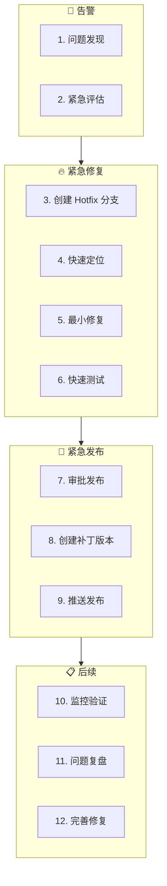

# 紧急发布工作流（Hotfix Workflow）

**工作流ID**: flow_hotfix  
**类型**: 临时工作流（Ad-hoc）  
**触发条件**: 线上紧急问题  
**紧急度**: 高

---

## 1. 工作流概述

紧急发布工作流用于处理线上紧急问题，需要快速修复并发布补丁版本。

### 1.1 目标

- 快速响应线上问题
- 最小范围修复
- 快速验证发布
- 后续完善跟进

### 1.2 适用场景

| 场景 | 说明 |
|------|------|
| 线上崩溃 | 系统不可用 |
| 数据问题 | 数据丢失或损坏风险 |
| 安全漏洞 | 安全风险暴露 |
| 严重Bug | 核心功能不可用 |

### 1.3 参与角色

| 角色 | 职责 |
|------|------|
| 值班人员 | 问题响应、协调 |
| 开发者 | 快速修复 |
| 测试人员 | 快速验证 |
| 发布负责人 | 批准发布 |

---

## 2. 工作流步骤



---

## 3. 详细步骤说明

### 3.1 问题发现

**问题来源**:
- 监控告警
- 用户反馈
- 内部发现

**紧急问题报告**:
```markdown
## 紧急问题报告

**问题ID**: HOTFIX-001
**报告时间**: 2026-02-01 14:30
**报告人**: xxx
**严重级别**: P0 (阻塞)

### 问题描述
用户登录功能完全失效，所有用户无法登录系统。

### 影响范围
- 影响用户: 全部
- 影响功能: 登录、认证
- 业务影响: 系统不可用

### 初步信息
- 错误日志: [附件]
- 开始时间: 约 14:00
- 可能原因: 待分析
```

---

### 3.2 紧急评估

**评估时间**: ≤15分钟

**评估内容**:
| 维度 | 评估项 |
|------|--------|
| 影响范围 | 多少用户受影响 |
| 业务影响 | 是否阻塞核心业务 |
| 数据风险 | 是否有数据损失风险 |
| 安全风险 | 是否有安全暴露 |

**决策**:
- ✅ 启动 Hotfix → 继续流程
- ⚠️ 非紧急 → 转为普通 Bugfix
- ❓ 需更多信息 → 快速收集后决策

---

### 3.3 创建 Hotfix 分支

**分支策略**:
```bash
# 从最新的发布 Tag 创建 Hotfix 分支
git checkout -b hotfix/v0.1.1 v0.1.0
```

**分支命名**: `hotfix/v{VERSION}`

---

### 3.4 快速定位

**定位时间**: ≤30分钟

**定位方法**:
1. 查看错误日志
2. 对比最近变更
3. 检查配置变化
4. 分析监控数据

**AI 介入点**:
```
提示词：
"紧急分析以下错误日志，快速定位问题原因：
[日志内容]
最近的变更：
[变更列表]"
```

**定位结果**:
```markdown
### 问题定位

**定位时间**: 14:45
**根因**: 配置文件中数据库连接字符串被意外清空

**问题代码**:
- 文件: config/database.conf
- 行号: 15
- 原因: 部署脚本 Bug 导致配置被覆盖

**快速验证**: 手动恢复配置后问题消失
```

---

### 3.5 最小修复

**修复原则**:
- ⚠️ **最小范围**: 只修复问题，不做优化
- ⚠️ **最低风险**: 选择最安全的修复方案
- ⚠️ **可回滚**: 确保修复可回滚

**修复代码**:
```cpp
// HOTFIX-001: 修复配置加载问题
// TODO: 后续需要添加配置校验
if (config.empty()) {
    config = getDefaultConfig();  // 临时方案
    LOG_WARN("Config empty, using default");
}
```

**追溯注释**:
```cpp
// HOTFIX-001: 紧急修复 - 配置为空时使用默认值
// 后续跟进: 需要在 flow_bugfix 中完善配置校验
```

---

### 3.6 快速测试

**测试时间**: ≤30分钟

**测试范围**:
| 类型 | 内容 | 必须 |
|------|------|------|
| 冒烟测试 | 核心功能可用 | ✅ |
| 问题验证 | 问题已修复 | ✅ |
| 回归测试 | 主要功能不受影响 | ✅ |
| 完整测试 | 全部测试用例 | ❌ (后续) |

**测试结果**:
```markdown
### 快速测试结果

**测试时间**: 15:15 - 15:30
**测试人**: xxx

| 测试项 | 结果 | 备注 |
|--------|------|------|
| 登录功能 | ✅ PASS | 问题已修复 |
| 登出功能 | ✅ PASS | |
| 基础认证 | ✅ PASS | |
| 数据读取 | ✅ PASS | |

**结论**: 可以发布
```

---

### 3.7 审批发布

**审批时间**: ≤15分钟

**审批内容**:
- [ ] 问题已定位
- [ ] 修复已验证
- [ ] 风险可控
- [ ] 可回滚

**审批记录**:
```markdown
### Hotfix 发布审批

**Hotfix ID**: HOTFIX-001
**版本**: v0.1.1
**审批人**: xxx
**审批时间**: 15:45
**决策**: ✅ 批准发布

**回滚计划**: 回滚到 v0.1.0
**监控重点**: 登录成功率、错误日志
```

---

### 3.8 创建补丁版本

**版本号**: 在 PATCH 位增加

```bash
# 更新版本号
echo "v0.1.1" > VERSION

# 提交修复
git add -A
git commit -m "hotfix: HOTFIX-001 修复配置加载问题

问题: 配置文件为空导致登录失败
修复: 配置为空时使用默认配置
测试: 冒烟测试通过

HOTFIX-001"
```

**Tag 内容**:
```
Hotfix v0.1.1: 修复配置加载问题

🔥 紧急修复
- 修复配置文件为空导致的登录失败问题

⚠️ 注意事项
- 这是紧急修复版本
- 后续需要完善配置校验逻辑

📋 关联
- HOTFIX-001
- 后续任务: BUG-002 (完善配置校验)

✅ 状态: 紧急发布
```

```bash
git tag -a v0.1.1 -m "上述内容"
```

---

### 3.9 推送发布

```bash
# 推送 Hotfix 分支
git push origin hotfix/v0.1.1

# 推送 Tag
git push origin v0.1.1

# 合并回 main
git checkout main
git merge hotfix/v0.1.1
git push origin main
```

---

### 3.10 监控验证

**监控时间**: 发布后 1-2 小时

**监控指标**:
| 指标 | 正常范围 | 当前值 | 状态 |
|------|----------|--------|------|
| 登录成功率 | >99% | 99.5% | ✅ |
| 错误率 | <0.1% | 0.02% | ✅ |
| 响应时间 | <500ms | 120ms | ✅ |

**验证结论**:
- ✅ 问题已解决
- ✅ 无新问题
- ✅ 指标正常

---

### 3.11 问题复盘

**复盘时间**: 发布后 24-48 小时内

**复盘内容**:
```markdown
### HOTFIX-001 复盘

#### 时间线
| 时间 | 事件 |
|------|------|
| 14:00 | 问题开始发生 |
| 14:30 | 发现问题 |
| 14:45 | 定位根因 |
| 15:30 | 修复完成 |
| 15:45 | 审批通过 |
| 16:00 | 发布完成 |
| 16:30 | 验证正常 |

#### 根因分析
部署脚本中存在 Bug，在特定条件下会覆盖配置文件。

#### 改进措施
| 改进项 | 负责人 | 计划时间 |
|--------|--------|----------|
| 修复部署脚本 | dev1 | Sprint 1.3 |
| 添加配置校验 | dev2 | Sprint 1.3 |
| 添加配置监控 | ops1 | Sprint 1.3 |

#### 经验教训
1. 部署脚本需要更完善的测试
2. 配置文件需要有效性校验
3. 需要配置变更监控
```

---

### 3.12 完善修复

**后续任务**:
1. 创建 Bug 单完善修复
2. 添加相关测试用例
3. 更新相关文档
4. 实施改进措施

转入 → [问题修复工作流](flow_bugfix.md)

---

## 4. 时间线要求

| 阶段 | 时间要求 | 累计时间 |
|------|----------|----------|
| 问题发现 | - | - |
| 紧急评估 | ≤15min | 15min |
| 创建分支 | ≤5min | 20min |
| 快速定位 | ≤30min | 50min |
| 最小修复 | ≤30min | 80min |
| 快速测试 | ≤30min | 110min |
| 审批发布 | ≤15min | 125min |
| 创建版本 | ≤15min | 140min |
| 推送发布 | ≤10min | 150min |
| **总计** | | **≤2.5小时** |

---

## 5. 产出物清单

| 产出物 | 存放位置 | 说明 |
|--------|----------|------|
| 紧急问题报告 | `Progress/hotfix/` | 问题记录 |
| Hotfix 分支 | Git | 修复代码 |
| 补丁版本 Tag | Git | v0.1.1 |
| 复盘报告 | `Progress/hotfix/` | 经验总结 |

---

## 6. 回滚计划

**回滚触发条件**:
- 修复导致新问题
- 问题未解决
- 性能严重下降

**回滚步骤**:
```bash
# 回滚到上一版本
git checkout v0.1.0

# 重新部署
# [部署命令]

# 通知相关方
```

---

## 7. 关联工作流

- **来源**: 监控告警 / 用户反馈
- **后续**: [问题修复工作流](flow_bugfix.md)（完善修复）
- **合并**: [发布工作流](flow_release.md)（合并到主版本）

---

## 8. 变更历史

| 版本 | 日期 | 变更内容 |
|------|------|----------|
| v1.0.0 | 2026-02-01 | 初始版本 |

