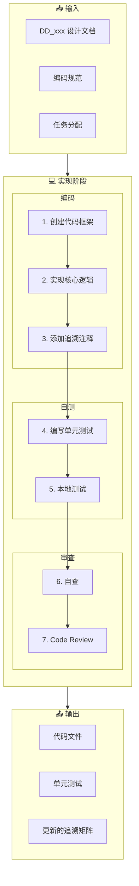

# 实现工作流（Implement Workflow）

**工作流ID**: flow_implement  
**类型**: 例行工作流（Routine）  
**触发条件**: 设计评审通过后  
**周期**: 日常

---

## 1. 工作流概述

实现工作流负责将 L3 详细设计转化为可运行的代码（L4），是开发过程中最频繁执行的工作流。

### 1.1 目标

- 按照设计文档实现代码
- 保持代码与设计的追溯关系
- 确保代码质量
- 完成单元测试

### 1.2 参与角色

| 角色 | 职责 |
|------|------|
| 开发者 | 编码实现、自测 |
| AI Agent | 代码生成、代码审查 |
| 评审者 | Code Review |

---

## 2. 工作流步骤



---

## 3. 详细步骤说明

### 3.1 创建代码框架

**目的**: 基于设计创建代码结构

**输入**:
- DD_xxx 设计文档
- 编码规范 (rules_coding.md)

**执行动作**:
1. 创建文件/目录结构
2. 添加文件头注释（含追溯）
3. 定义类/模块框架
4. 声明接口

**文件头注释模板（C++）**:
```cpp
/**
 * @file    login_handler.cpp
 * @brief   登录处理模块
 * 
 * @requirement FR_core_001 - 用户认证
 * @design DD_core_001 - 登录模块设计
 * 
 * @author  Developer
 * @date    2026-02-01
 * @version 1.0.0
 */
```

**文件头注释模板（Python）**:
```python
"""
登录处理模块

Traceability:
    - Requirement: FR_core_001 - 用户认证
    - Design: DD_core_001 - 登录模块设计

Author: Developer
Date: 2026-02-01
Version: 1.0.0
"""
```

**AI 介入点**:
```
提示词：
"基于 DD_core_001 设计文档，创建代码框架：
- 文件结构
- 类/接口声明
- 包含追溯注释
遵循: archpilot/Governance/rules/rules_coding.md"
```

**检查点**:
- [ ] 文件头包含追溯信息
- [ ] 命名符合规范
- [ ] 目录结构正确

---

### 3.2 实现核心逻辑

**目的**: 编写功能实现代码

**输入**:
- 代码框架
- DD_xxx 中的算法设计

**执行动作**:
1. 按设计实现算法
2. 处理边界条件
3. 添加错误处理
4. 编写日志输出

**编码原则**:
- 遵循设计文档
- 保持代码简洁
- 单一职责原则
- 适当注释

**AI 介入点**:
```
提示词：
"根据 DD_core_001 中的算法设计，实现以下功能：
[算法描述]
要求：
- 完整的错误处理
- 日志输出
- 遵循编码规范"
```

**检查点**:
- [ ] 逻辑与设计一致
- [ ] 边界条件处理
- [ ] 错误处理完善
- [ ] 代码可读性好

---

### 3.3 添加追溯注释

**目的**: 建立代码到设计的追溯关系

**追溯注释类型**:

| 类型 | 位置 | 格式 |
|------|------|------|
| 文件级 | 文件头 | `@requirement`, `@design` |
| 函数级 | 函数注释 | `@trace DD_xxx Section X` |
| 行级 | 关键代码行 | `// Ref: DD_xxx.3.2` |

**函数级追溯示例**:
```cpp
/**
 * @brief 验证用户凭证
 * @trace DD_core_001 Section 4.2 - 凭证验证算法
 * 
 * @param username 用户名
 * @param password 密码
 * @return 验证结果
 */
bool validateCredentials(const string& username, const string& password);
```

**关键逻辑追溯示例**:
```cpp
// 密码哈希验证 - Ref: DD_core_001.4.2.3
string hash = computeHash(password, salt);
if (hash != storedHash) {
    // 错误处理 - Ref: DD_core_001.5.1
    logFailedAttempt(username);
    return false;
}
```

---

### 3.4 编写单元测试

**目的**: 验证代码正确性

**输入**:
- 实现代码
- DD_xxx 中的测试考虑

**测试文件命名**:
```
test_[模块名].cpp / test_[模块名].py
示例: test_login_handler.cpp
```

**测试用例结构**:
```cpp
/**
 * @test 测试 validateCredentials 函数
 * @trace DD_core_001 Section 4.2
 */
TEST(LoginHandlerTest, ValidateCredentials_ValidUser_ReturnsTrue) {
    // Arrange
    string username = "testuser";
    string password = "correctpassword";
    
    // Act
    bool result = validateCredentials(username, password);
    
    // Assert
    EXPECT_TRUE(result);
}
```

**AI 介入点**:
```
提示词：
"为 login_handler.cpp 中的 validateCredentials 函数生成单元测试：
- 正常场景
- 边界条件
- 异常场景
参考: DD_core_001 Section 12"
```

**检查点**:
- [ ] 覆盖正常场景
- [ ] 覆盖边界条件
- [ ] 覆盖异常场景
- [ ] 测试独立可运行

---

### 3.5 本地测试

**目的**: 在本地验证实现

**执行动作**:
1. 编译/构建代码
2. 运行单元测试
3. 检查测试覆盖率
4. 修复失败的测试

**验收标准**:
- [ ] 编译无错误
- [ ] 编译无警告（或已豁免）
- [ ] 单元测试全部通过
- [ ] 覆盖率达标（如 >80%）

---

### 3.6 自查

**目的**: 提交 Review 前的自检

**自查清单**:
- [ ] 代码符合编码规范
- [ ] 追溯注释完整
- [ ] 无调试代码残留
- [ ] 无硬编码敏感信息
- [ ] 注释准确清晰
- [ ] 单元测试完整
- [ ] 本地测试通过

---

### 3.7 Code Review

**目的**: 同行评审，确保代码质量

**Review 关注点**:
| 维度 | 检查内容 |
|------|----------|
| 正确性 | 逻辑是否正确，是否符合设计 |
| 规范性 | 是否遵循编码规范 |
| 可读性 | 代码是否易于理解 |
| 健壮性 | 错误处理是否完善 |
| 追溯性 | 追溯注释是否完整 |
| 测试性 | 单元测试是否充分 |

**Review 结果**:
- ✅ 通过 → 合并代码
- ⚠️ 需修改 → 修改后重新 Review
- ❌ 重大问题 → 讨论并重新实现

---

## 4. 产出物清单

| 产出物 | 存放位置 | 追溯关系 |
|--------|----------|----------|
| 代码文件 | `L4_Implementation/src/` | 文件头追溯到 DD |
| 单元测试 | `L5_Verification/unit/` | 测试追溯到 DD |
| 测试报告 | `L5_Verification/reports/` | - |

---

## 5. 追溯关系维护

### 5.1 更新追溯矩阵

当代码实现完成后，更新追溯矩阵：

```markdown
| L1 需求 | L2 架构 | L3 设计 | L4 实现 | L5 测试 |
|---------|---------|---------|---------|---------|
| FR_core_001 | SA_core_001 | DD_core_001 | login_handler.cpp | test_login_handler.cpp |
```

### 5.2 追溯验证

使用脚本验证追溯完整性：
```bash
python archpilot/Scripts/validate_trace.py --full-chain
```

---

## 6. AI 辅助命令

```bash
# 生成代码框架
"基于 DD_core_001，生成代码框架，包含追溯注释"

# 实现功能
"实现 DD_core_001 Section 4 中描述的验证逻辑"

# 生成单元测试
"为 login_handler.cpp 生成单元测试"

# Code Review
"Review 以下代码，检查编码规范、错误处理、追溯完整性"
```

---

## 7. 关联工作流

- **上游**: [设计工作流](flow_design.md)
- **下游**: [发布工作流](flow_release.md)
- **临时**: [问题修复工作流](flow_bugfix.md)

---

## 8. 变更历史

| 版本 | 日期 | 变更内容 |
|------|------|----------|
| v1.0.0 | 2026-02-01 | 初始版本 |

