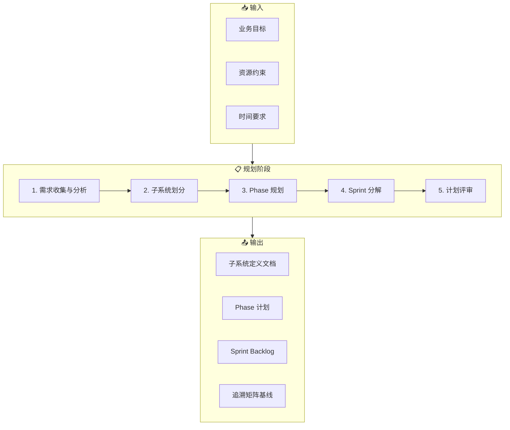

# 规划工作流（Planning Workflow）

**工作流ID**: flow_planning  
**类型**: 例行工作流（Routine）  
**触发条件**: 新项目启动 / 新Phase开始  
**周期**: Phase级

---

## 1. 工作流概述

规划工作流是项目的起点，负责将业务目标转化为可执行的开发计划，包括子系统划分、Phase规划、迭代安排等。

### 1.1 目标

- 明确项目/Phase的范围和边界
- 划分子系统和模块
- 制定迭代计划和里程碑
- 建立追溯基线

### 1.2 参与角色

| 角色 | 职责 |
|------|------|
| 项目负责人 | 审批计划、确定优先级 |
| 架构师 | 子系统划分、技术选型 |
| AI Agent | 辅助分析、文档生成 |

---

## 2. 工作流步骤



---

## 3. 详细步骤说明

### 3.1 需求收集与分析

**目的**: 收集并理解业务需求

**输入**:
- 业务目标描述
- 用户需求
- 技术约束

**执行动作**:
1. 与业务方沟通，理解核心需求
2. 识别关键功能点
3. 评估技术可行性
4. 确定优先级

**AI 介入点**:
```
提示词示例：
"分析以下业务需求，提取关键功能点并按优先级排序：
[需求描述]"
```

**输出**:
- 需求清单（初稿）
- 优先级矩阵

**检查点**:
- [ ] 需求是否清晰明确
- [ ] 是否覆盖所有利益相关方
- [ ] 优先级是否合理

---

### 3.2 子系统划分

**目的**: 将系统分解为可管理的子系统

**输入**:
- 需求清单
- 技术架构参考

**执行动作**:
1. 按功能域划分子系统
2. 定义子系统边界和接口
3. 确定子系统缩写和前缀
4. 建立子系统依赖关系

**划分原则**:

| 原则 | 说明 |
|------|------|
| 高内聚 | 相关功能归入同一子系统 |
| 低耦合 | 子系统间依赖最小化 |
| 可独立 | 每个子系统可独立开发和测试 |
| 清晰边界 | 接口明确定义 |

**子系统定义模板**:

```markdown
| 子系统 | 缩写 | 职责 | 依赖 |
|--------|------|------|------|
| 核心功能 | core | 核心业务逻辑 | - |
| 数据管理 | data | 数据存储与处理 | core |
| 用户界面 | ui | 用户交互界面 | core, data |
| 工具集 | util | 通用工具 | - |
| 分析引擎 | anl | 数据分析 | data |
| 平台管理 | plt | 平台配置管理 | core |
```

**AI 介入点**:
```
提示词示例：
"基于以下需求清单，建议合理的子系统划分方案：
[需求清单]
要求：高内聚低耦合，每个子系统有明确职责"
```

**输出**:
- 子系统划分文档
- 子系统依赖图

**检查点**:
- [ ] 子系统划分是否合理
- [ ] 缩写是否唯一且有意义
- [ ] 依赖关系是否清晰

---

### 3.3 Phase 规划

**目的**: 制定中期里程碑计划

**输入**:
- 子系统划分
- 项目时间约束
- 资源情况

**执行动作**:
1. 确定 Phase 数量和时间跨度
2. 分配子系统/功能到各 Phase
3. 定义每个 Phase 的交付目标
4. 设置里程碑检查点

**Phase 规划模板**:

```markdown
## Phase 1: 基础能力（Foundation）
**时间**: Week 1-4
**目标**: 搭建基础框架，实现核心功能

### 范围
- [x] core 子系统基础实现
- [x] util 工具集
- [ ] 基础测试框架

### 里程碑
- M1.1: 框架搭建完成
- M1.2: 核心功能可用
- M1.3: Phase 1 验收

### 交付物
- L1 需求文档: FR_core_001 ~ FR_core_005
- L2 架构文档: SA_core_001
- L4 代码: core/, util/
- L5 测试: TC-core-*
```

**AI 介入点**:
```
提示词示例：
"根据以下子系统和依赖关系，规划合理的Phase分期：
[子系统列表和依赖]
约束：总周期12周，4个Phase"
```

**输出**:
- Phase 计划文档
- 里程碑清单

**检查点**:
- [ ] Phase 划分是否合理
- [ ] 时间估算是否可行
- [ ] 依赖顺序是否正确

---

### 3.4 Sprint 分解

**目的**: 将 Phase 分解为可执行的迭代

**输入**:
- Phase 计划
- 团队产能

**执行动作**:
1. 将 Phase 目标分解为 Sprint
2. 为每个 Sprint 定义 User Story / Task
3. 估算工作量
4. 建立 Sprint Backlog

**Sprint 计划模板**:

```markdown
## Sprint 1.1: 核心框架搭建
**时间**: Week 1-2
**目标**: 完成核心框架和基础组件

### Backlog
| ID | 任务 | 优先级 | 估时 | 状态 |
|----|------|--------|------|------|
| T1.1.1 | 项目初始化 | P0 | 0.5d | ✅ |
| T1.1.2 | 核心接口定义 | P0 | 1d | 🔄 |
| T1.1.3 | 基础数据结构 | P0 | 1d | ⬜ |
| T1.1.4 | 日志框架 | P1 | 0.5d | ⬜ |

### Definition of Done
- [ ] 所有 P0 任务完成
- [ ] 代码通过 Review
- [ ] 单元测试通过
```

**输出**:
- Sprint 计划
- Sprint Backlog

**检查点**:
- [ ] 任务颗粒度是否合适（1-3天）
- [ ] 优先级是否正确
- [ ] DoD 是否明确

---

### 3.5 计划评审

**目的**: 评审并确认计划

**输入**:
- 完整的规划文档

**执行动作**:
1. 组织评审会议
2. 收集反馈
3. 调整计划
4. 正式发布

**评审检查清单**:
- [ ] 需求覆盖完整
- [ ] 子系统划分合理
- [ ] Phase 时间可行
- [ ] Sprint 颗粒度适中
- [ ] 风险已识别
- [ ] 资源已确认

**输出**:
- 评审通过的计划
- 调整记录

---

## 4. 产出物清单

| 产出物 | 存放位置 | 模板 |
|--------|----------|------|
| 子系统划分文档 | `L2_Architecture/` | - |
| Phase 计划 | `Progress/phase_plan.md` | ✅ |
| Sprint Backlog | `Progress/sprint_*.md` | ✅ |
| 追溯矩阵基线 | `Governance/traceability_matrix.md` | ✅ |

---

## 5. AI 辅助脚本

```bash
# 使用 AI 辅助规划
# 1. 准备需求输入文件
# 2. 执行分析

# 示例：子系统划分建议
echo "请分析以下需求并建议子系统划分..."

# 示例：Phase 规划建议
echo "基于子系统依赖，规划4个Phase..."
```

---

## 6. 常见问题

### Q1: 子系统划分太细怎么办？
**A**: 合并相关性高的子系统，保持 3-7 个为宜。

### Q2: Phase 时间不够怎么办？
**A**: 重新评估范围，考虑移除低优先级功能。

### Q3: 需求不明确如何规划？
**A**: 先做原型或 PoC，明确后再细化计划。

---

## 7. 关联工作流

- **下游**: [设计工作流](flow_design.md)
- **支撑**: [需求变更工作流](flow_change.md)

---

## 8. 变更历史

| 版本 | 日期 | 变更内容 |
|------|------|----------|
| v1.0.0 | 2026-02-01 | 初始版本 |

