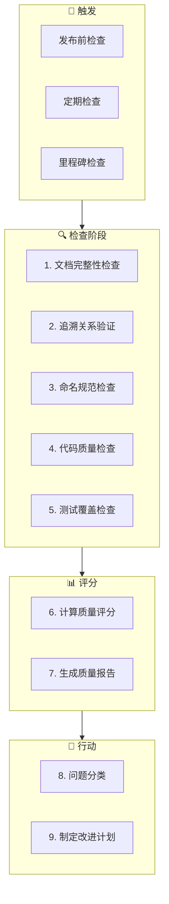

# 质量检查工作流（Quality Workflow）

**工作流ID**: flow_quality  
**类型**: 支撑工作流（Support）  
**触发条件**: 发布前 / 定期检查  
**周期**: 迭代级

---

## 1. 工作流概述

质量检查工作流用于系统性检查项目质量，确保交付物符合规范和标准。

### 1.1 目标

- 验证文档完整性
- 检查追溯关系
- 评估代码质量
- 输出质量报告

### 1.2 参与角色

| 角色 | 职责 |
|------|------|
| 质量负责人 | 组织检查、审核报告 |
| AI Agent | 自动化检查、报告生成 |
| 开发团队 | 问题修复 |

---

## 2. 工作流步骤



---

## 3. 详细步骤说明

### 3.1 文档完整性检查

**目的**: 确保 L1-L3 文档完整

**检查内容**:

| 检查项 | 说明 | 必须 |
|--------|------|------|
| L1 需求文档 | 每个功能有对应 FR | ✅ |
| L2 架构文档 | 关键模块有 SA | ✅ |
| L3 设计文档 | 复杂模块有 DD | ⚠️ |
| 文档元数据 | YAML Front Matter 完整 | ✅ |
| 文档版本 | 版本号正确 | ✅ |

**检查命令**:
```bash
# 检查 L1 文档数量
ls -la L1_Requirements/*.md | wc -l

# 检查元数据完整性
python archpilot/Scripts/check_metadata.py --dir L1_Requirements/
```

**AI 介入点**:
```
提示词：
"检查 L1_Requirements 目录下的所有文档：
1. 统计文档数量
2. 验证 YAML 元数据完整性
3. 检查必需字段是否存在"
```

**输出**: 文档完整性报告

---

### 3.2 追溯关系验证

**目的**: 确保 L1-L5 追溯链完整

**验证规则**:
```
L1 (FR) ← L2 (SA) ← L3 (DD) ← L4 (Code) ← L5 (TC) → L1 (闭环)
```

**检查内容**:
- [ ] 每个 SA 都追溯到 FR
- [ ] 每个 DD 都追溯到 SA
- [ ] 每个代码文件都追溯到 DD
- [ ] 每个 TC 都追溯到 FR
- [ ] 无孤立的文档

**检查命令**:
```bash
python archpilot/Scripts/validate_trace.py --full-chain --output trace_report.json
```

**追溯问题类型**:
| 问题类型 | 严重性 | 说明 |
|----------|--------|------|
| 断裂的追溯链 | 高 | 某层文档无上游追溯 |
| 孤立的文档 | 中 | 文档无任何追溯关系 |
| 无效的追溯引用 | 高 | 引用的文档不存在 |
| 循环追溯 | 高 | 追溯关系形成循环 |

**输出**: 追溯验证报告

---

### 3.3 命名规范检查

**目的**: 确保命名符合规范

**检查内容**:
| 类型 | 规范 | 示例 |
|------|------|------|
| L1 文档 | `FR_[子系统]_[编号]_[描述].md` | FR_core_001_user_auth.md |
| L2 文档 | `SA_[子系统]_[编号]_[描述].md` | SA_core_001_auth_arch.md |
| L3 文档 | `DD_[子系统]_[编号]_[描述].md` | DD_core_001_login.md |
| L5 测试 | `TC-[子系统]-[编号]-[类型]-[描述].md` | TC-core-001-unit-login.md |
| 代码文件 | snake_case | login_handler.cpp |
| 类名 | PascalCase | LoginHandler |

**检查命令**:
```bash
python archpilot/Scripts/check_naming.py --dir . --output naming_report.json
```

**输出**: 命名检查报告

---

### 3.4 代码质量检查

**目的**: 评估代码质量

**检查内容**:
| 检查项 | 工具 | 阈值 |
|--------|------|------|
| 静态分析 | cppcheck/pylint | 无 Error |
| 代码复杂度 | 圈复杂度 | ≤10 |
| 重复代码 | CPD | ≤5% |
| 追溯注释 | 自定义脚本 | 100% |

**检查命令**:
```bash
# C++ 静态分析
cppcheck --enable=all L4_Implementation/src/

# Python 静态分析
pylint L4_Implementation/src/

# 代码追溯检查
python archpilot/Scripts/check_code_trace.py --dir L4_Implementation/src/
```

**输出**: 代码质量报告

---

### 3.5 测试覆盖检查

**目的**: 评估测试充分性

**检查内容**:
| 检查项 | 目标 | 说明 |
|--------|------|------|
| 需求覆盖率 | 100% | 每个 FR 至少一个 TC |
| 代码覆盖率 | ≥80% | 行覆盖率 |
| 分支覆盖率 | ≥70% | 分支覆盖率 |
| 测试通过率 | 100% | 发布前必须全部通过 |

**检查命令**:
```bash
# 需求覆盖率检查
python archpilot/Scripts/check_requirement_coverage.py

# 代码覆盖率（示例）
gcov -r L4_Implementation/src/*.cpp
```

**输出**: 测试覆盖报告

---

### 3.6 计算质量评分

**目的**: 量化质量水平

**评分维度**（5分制）:

| 维度 | 代码 | 权重 | 评估内容 |
|------|------|------|----------|
| 文档完整性 | D1 | 20% | L1-L3 文档完整度 |
| 追溯关系 | D2 | 15% | 追溯链完整性 |
| 功能实现 | D3 | 30% | 功能完成度 |
| 测试验证 | D4 | 25% | 测试覆盖率和通过率 |
| 代码质量 | D5 | 10% | 静态分析、规范性 |

**评分标准**:

| 分数 | 等级 | 说明 |
|------|------|------|
| 5.0 | 优秀 | 完全符合，无任何问题 |
| 4.0-4.9 | 良好 | 基本符合，有小问题 |
| 3.0-3.9 | 及格 | 部分符合，有明显问题 |
| 2.0-2.9 | 不及格 | 不符合，问题较多 |
| 1.0-1.9 | 差 | 严重不符合 |

**计算公式**:
```
总分 = D1×0.2 + D2×0.15 + D3×0.3 + D4×0.25 + D5×0.1
```

**检查命令**:
```bash
python archpilot/Scripts/calculate_score.py --version v0.1.0 --output quality_score.json
```

---

### 3.7 生成质量报告

**目的**: 输出综合质量报告

**报告结构**:
```markdown
# 质量检查报告

## 概要信息
- 检查时间: 2026-02-01
- 版本: v0.1.0
- 检查人: AI Agent

## 质量评分

| 维度 | 得分 | 加权得分 | 说明 |
|------|------|----------|------|
| D1: 文档完整性 | 4.5 | 0.90 | 文档基本完整 |
| D2: 追溯关系 | 4.0 | 0.60 | 2处追溯缺失 |
| D3: 功能实现 | 4.5 | 1.35 | 功能全部完成 |
| D4: 测试验证 | 4.0 | 1.00 | 覆盖率85% |
| D5: 代码质量 | 4.0 | 0.40 | 3处静态警告 |
| **总分** | | **4.25** | **良好** |

## 问题清单

### 高优先级
1. [追溯] DD_core_002 缺少 traces_from
2. [追溯] TC-core-005 未追溯到需求

### 中优先级
3. [命名] test_util.py 不符合命名规范
4. [代码] login_handler.cpp:125 圈复杂度过高

### 低优先级
5. [文档] FR_core_003 缺少验收条件

## 改进建议
...
```

---

### 3.8 问题分类

**分类维度**:

| 优先级 | 说明 | 处理要求 |
|--------|------|----------|
| P0 | 阻塞发布 | 发布前必须修复 |
| P1 | 严重问题 | 本迭代修复 |
| P2 | 一般问题 | 下迭代修复 |
| P3 | 轻微问题 | 计划修复 |

---

### 3.9 制定改进计划

**改进计划模板**:
```markdown
## 质量改进计划

### 本次检查问题统计
| 优先级 | 数量 | 修复计划 |
|--------|------|----------|
| P0 | 0 | - |
| P1 | 2 | Sprint 1.2 |
| P2 | 3 | Sprint 1.3 |
| P3 | 5 | Backlog |

### 具体改进任务
| ID | 问题 | 负责人 | 计划时间 |
|----|------|--------|----------|
| Q001 | 补充 DD_core_002 追溯 | dev1 | 2026-02-02 |
| Q002 | 补充 TC-core-005 追溯 | dev2 | 2026-02-02 |
```

---

## 4. 定期检查计划

| 检查类型 | 频率 | 范围 |
|----------|------|------|
| 日常检查 | 每日 | 命名规范 |
| Sprint 检查 | 每2周 | 文档+追溯 |
| 发布检查 | 每次发布 | 全部检查 |
| 季度审计 | 每季度 | 深度审查 |

---

## 5. 产出物清单

| 产出物 | 存放位置 | 说明 |
|--------|----------|------|
| 质量报告 | `Progress/quality/` | 综合报告 |
| 追溯报告 | `Progress/quality/` | 追溯验证 |
| 改进计划 | `Progress/quality/` | 问题修复计划 |

---

## 6. 自动化集成

```yaml
# 示例：CI/CD 集成
quality_check:
  stage: quality
  script:
    - python archpilot/Scripts/validate_trace.py
    - python archpilot/Scripts/check_naming.py
    - python archpilot/Scripts/calculate_score.py
  artifacts:
    paths:
      - quality_report.md
```

---

## 7. 关联工作流

- **触发**: [实现工作流](flow_implement.md)（完成后）
- **下游**: [发布工作流](flow_release.md)（发布前）
- **支撑**: [追溯验证工作流](flow_trace.md)

---

## 8. 变更历史

| 版本 | 日期 | 变更内容 |
|------|------|----------|
| v1.0.0 | 2026-02-01 | 初始版本 |

