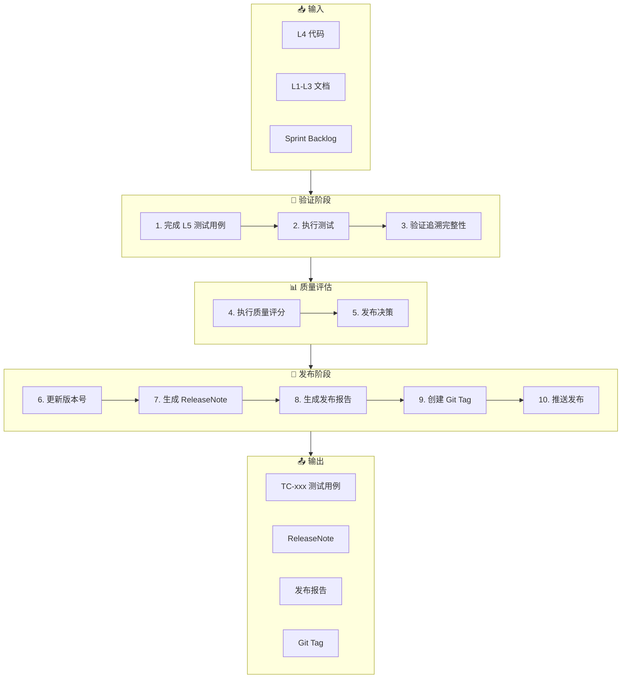

# 发布工作流（Release Workflow）

**工作流ID**: flow_release  
**类型**: 例行工作流（Routine）  
**触发条件**: 迭代完成 / 里程碑达成  
**周期**: 迭代级

---

## 1. 工作流概述

发布工作流负责将经过验证的代码正式发布，包括质量评估、版本管理、文档生成和正式发布。

### 1.1 目标

- 完成 L5 测试验证
- 执行质量评分
- 生成发布文档
- 创建正式版本

### 1.2 参与角色

| 角色 | 职责 |
|------|------|
| 发布负责人 | 审批发布、最终确认 |
| 测试人员 | 执行验收测试 |
| AI Agent | 质量评分、报告生成 |

---

## 2. 工作流步骤



---

## 3. 详细步骤说明

### 3.1 完成 L5 测试用例

**目的**: 确保测试覆盖所有需求

**输入**:
- FR_xxx 需求文档
- DD_xxx 设计文档
- 已实现的代码

**测试用例命名**:
```
TC-[子系统]-[编号]-[类型]-[描述].md
类型: unit / integ / sys / accept
示例: TC-core-001-unit-login-validation.md
```

**执行动作**:
1. 基于 FR 创建测试用例
2. 设置追溯关系
3. 定义测试步骤
4. 明确预期结果

**追溯设置**:
```yaml
---
id: TC-core-001-unit-login
layer: L5
type: test
traces_from: [FR_core_001, DD_core_001]
---
```

**AI 介入点**:
```
提示词：
"基于 FR_core_001 的验收条件，生成测试用例：
- 覆盖所有功能点
- 包含正向和逆向测试
- 使用 TC 模板"
```

**检查点**:
- [ ] 每个 FR 至少有一个 TC
- [ ] traces_from 正确设置
- [ ] 测试步骤清晰

---

### 3.2 执行测试

**目的**: 验证功能正确性

**测试类型**:
| 类型 | 说明 | 执行时机 |
|------|------|----------|
| unit | 单元测试 | 持续 |
| integ | 集成测试 | Sprint 结束 |
| sys | 系统测试 | Phase 结束 |
| accept | 验收测试 | 发布前 |

**执行动作**:
1. 运行自动化测试
2. 执行手动测试（如需要）
3. 记录测试结果
4. 标记通过/失败

**测试结果记录**:
```markdown
## 测试执行记录

| 用例ID | 用例名称 | 执行日期 | 结果 | 备注 |
|--------|----------|----------|------|------|
| TC-core-001-unit-login | 登录验证 | 2026-02-01 | ✅ PASS | |
| TC-core-002-unit-logout | 登出功能 | 2026-02-01 | ✅ PASS | |
```

**检查点**:
- [ ] 所有测试用例执行
- [ ] 通过率达标
- [ ] 失败用例已分析

---

### 3.3 验证追溯完整性

**目的**: 确保 L1-L5 追溯链完整

**执行动作**:
1. 运行追溯验证脚本
2. 检查断裂的追溯链
3. 修复追溯问题

**验证命令**:
```bash
python archpilot/Scripts/validate_trace.py --full-chain --output trace_report.json
```

**追溯完整性要求**:
```
L1 FR → L2 SA → L3 DD → L4 Code → L5 TC → L1 FR（闭环）
```

**检查点**:
- [ ] 无孤立的 L1 文档
- [ ] 无断裂的追溯链
- [ ] L5 回溯到 L1

---

### 3.4 执行质量评分

**目的**: 客观评估发布质量

**评分维度**（5分制）:

| 维度 | 权重 | 评估内容 |
|------|------|----------|
| D1: 文档完整性 | 20% | L1-L3 文档完整度 |
| D2: 追溯关系 | 15% | 追溯链完整性 |
| D3: 功能实现 | 30% | 功能完成度 |
| D4: 测试验证 | 25% | 测试覆盖率和通过率 |
| D5: 代码质量 | 10% | 代码规范性 |

**评分命令**:
```bash
python archpilot/Scripts/calculate_score.py --version v0.1.0 --output quality_score.json
```

**AI 介入点**:
```
提示词：
"执行发布质量评分：
- 检查 L1_Requirements/ 文档完整性
- 验证追溯关系
- 统计测试通过率
- 输出评分报告"
```

---

### 3.5 发布决策

**目的**: 基于评分决定是否发布

**决策矩阵**:

| 总分 | 评级 | 发布类型 | 决策 |
|------|------|----------|------|
| ≥4.5 | 优秀 | 正式版 | ✅ 推荐发布 |
| ≥4.0 | 良好 | 正式版 | ✅ 可以发布 |
| ≥3.0 | 及格 | Beta/RC | ⚠️ 有条件发布 |
| <3.0 | 不及格 | - | ❌ 禁止发布 |

**决策记录**:
```markdown
## 发布决策

**版本**: v0.1.0
**评分**: 4.2/5.0 (良好)
**决策**: ✅ 批准发布
**批准人**: xxx
**日期**: 2026-02-01
**备注**: 无
```

---

### 3.6 更新版本号

**目的**: 根据变更类型更新版本

**版本规则**（语义化版本）:
- MAJOR: 不兼容的变更
- MINOR: 向后兼容的新功能
- PATCH: 向后兼容的问题修复

**执行动作**:
1. 确定版本号
2. 更新 VERSION 文件
3. 更新相关文档中的版本

```bash
# 更新 VERSION 文件
echo "v0.1.0" > VERSION
```

---

### 3.7 生成 ReleaseNote

**目的**: 记录版本变更内容

**存放位置**: `ReleaseNote/v0.1.0.md`

**内容结构**:
```markdown
# v0.1.0 Release Notes

## 概述
- 版本: v0.1.0
- 发布日期: 2026-02-01
- 发布类型: Minor

## 🚀 新功能
- [新增] 用户认证模块
- [新增] 基础日志框架

## 🐛 Bug 修复
- 无

## ⚠️ 已知问题
- 无

## 📋 关联需求
- FR_core_001 用户认证
- FR_core_002 权限管理
```

**AI 介入点**:
```
提示词：
"根据本次发布的变更，生成 ReleaseNote：
- 遵循 ReleaseNote 模板
- 列出新功能和修复
- 关联相关 FR"
```

---

### 3.8 生成发布报告

**目的**: 详细记录发布质量

**存放位置**: `ReleaseNote/RELEASE_REPORT_v0.1.0.md`

**内容结构**:
```markdown
# v0.1.0 发布成果报告

## 质量评分
| 维度 | 得分 | 加权得分 |
|------|------|----------|
| D1 | 4.5 | 0.9 |
| D2 | 4.0 | 0.6 |
| D3 | 4.0 | 1.2 |
| D4 | 4.5 | 1.125 |
| D5 | 4.0 | 0.4 |
| **总分** | | **4.225** |

## 发布建议
✅ 可以正式发布

## 测试统计
- 用例总数: 15
- 通过: 15
- 失败: 0
- 通过率: 100%
```

---

### 3.9 创建 Git Tag

**目的**: 标记正式发布版本

**Tag 格式**:
```
Release v0.1.0: 简短标题

🚀 主要变更
- 变更1
- 变更2

📦 关键特性:
- 特性1
- 特性2

🧪 测试状态:
- 单元测试: 100% 通过

✅ 状态: 正式发布
```

**创建命令**:
```bash
git tag -a v0.1.0 -m "Release v0.1.0: 基础功能发布

🚀 主要变更
- 实现用户认证模块
- 添加基础日志框架

📦 关键特性:
- 用户登录/登出
- 权限验证

🧪 测试状态:
- 单元测试: 100%

✅ 状态: 正式发布"
```

---

### 3.10 推送发布

**目的**: 正式发布版本

**执行动作**:
1. 推送 Tag 到远程
2. 触发 CI/CD（如有）
3. 通知相关方

```bash
# 推送 Tag
git push origin v0.1.0

# 推送代码
git push origin main
```

---

## 4. 产出物清单

| 产出物 | 存放位置 | 说明 |
|--------|----------|------|
| TC-xxx.md | `L5_Verification/` | 测试用例 |
| v0.1.0.md | `ReleaseNote/` | 版本说明 |
| RELEASE_REPORT_v0.1.0.md | `ReleaseNote/` | 发布报告 |
| Git Tag | Git 仓库 | 版本标签 |
| VERSION | 项目根目录 | 版本文件 |

---

## 5. 发布检查清单

### 发布前
- [ ] 所有测试通过
- [ ] 追溯链完整
- [ ] 质量评分 ≥3.0
- [ ] ReleaseNote 已生成
- [ ] 发布报告已生成
- [ ] VERSION 已更新

### 发布中
- [ ] Tag 已创建
- [ ] Tag 内容符合规范
- [ ] Tag 已推送

### 发布后
- [ ] 验证 Tag 存在
- [ ] 通知相关方
- [ ] 更新项目状态

---

## 6. 关联工作流

- **上游**: [实现工作流](flow_implement.md)
- **下游**: [规划工作流](flow_planning.md)（下一迭代）
- **临时**: [紧急发布工作流](flow_hotfix.md)

---

## 7. 变更历史

| 版本 | 日期 | 变更内容 |
|------|------|----------|
| v1.0.0 | 2026-02-01 | 初始版本 |

