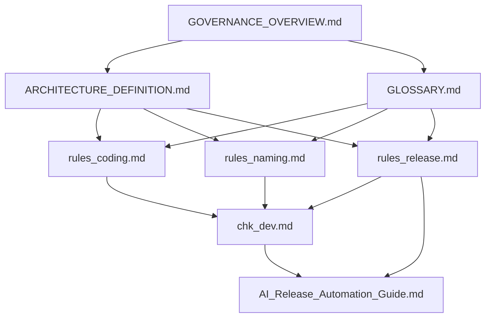

# ArchPilot Core - 架构领航核心

**版本**: v1.0.0  
**创建日期**: 2026-02-01  
**来源**: 从 ADPERF 项目治理体系中提炼的通用化架构设计引导框架

---

## 📋 概述

**ArchPilot Core** 是一套**面向架构设计引导的 AI Agent 框架**，旨在：

1. **规范 AI 开发行为**：通过预定义的规则约束 AI 在代码、文档、脚本等方面的操作
2. **保障工程质量**：建立可追溯的五层架构（L1-L5）体系，确保需求到验证的完整闭环
3. **加速项目启动**：提供可直接复用的模板、规则和检查清单
4. **支持多产品适配**：设计与具体产品解耦，适用于任意软件/系统工具开发

---

## 🏗️ 目录结构

```
archpilot_core/
├── README.md                           # 本文件：框架总览
├── QUICK_START.md                      # 快速开始指南
│
├── Governance/                         # 治理核心层（必须）
│   ├── GOVERNANCE_OVERVIEW.md          # 治理体系入口索引
│   ├── ARCHITECTURE_DEFINITION.md      # L1-L5 架构权威定义
│   ├── GLOSSARY.md                     # 术语标准表
│   ├── DOCUMENT_DEPENDENCY.mmd         # 文档依赖关系图
│   │
│   ├── rules/                          # 规则标准层
│   │   ├── rules_agent.md              # AI 变更保护与执行规则
│   │   ├── rules_coding.md             # 编码规范
│   │   ├── rules_naming.md             # 命名规范
│   │   ├── rules_scripts.md            # 脚本执行规范
│   │   ├── rules_release.md            # 发布管理规则
│   │   ├── rules_tag.md                # Git Tag 规范
│   │   └── rules_testcases.md          # 测试用例规范
│   │
│   ├── checklists/                     # 检查清单层
│   │   ├── chk_dev.md                   # 开发检查清单（L1-L5 一致性）
│   │   └── chk_release.md               # 发布检查清单
│   │
│   └── templates/                      # 模板层
│       ├── tpl_requirement.md          # L1 需求模板
│       ├── tpl_architecture.md         # L2 架构模板
│       ├── tpl_design.md               # L3 设计模板
│       ├── tpl_testcase.md             # L5 测试模板
│       ├── tpl_release_notes.md        # 发布说明模板
│       └── tpl_release_report.md       # 发布报告模板
│
├── Agents/                             # Agent 定义层
│   ├── README.md                       # Agent 使用说明
│   ├── agent_dev_main.md               # 主开发 Agent（规则约束）
│   ├── agent_reviewer.md               # 代码/文档审查 Agent
│   ├── agent_release.md                # 发布自动化 Agent
│   └── agent_qa.md                     # 质量保障 Agent
│
├── Guides/                             # AI 操作指南层
│   ├── AI_Development_Guide.md         # AI 开发指南
│   ├── AI_Release_Automation_Guide.md  # AI 发布自动化指南
│   └── AI_Prompt_Library.md            # AI 提示词库
│
├── Scripts/                            # 自动化脚本模板
│   ├── README.md                       # 脚本使用说明
│   ├── check_naming.py                 # 命名检查脚本模板
│   ├── validate_trace.py               # 追溯验证脚本模板
│   └── calculate_score.py              # 质量评分脚本模板
│
└── Examples/                           # 示例项目
    └── README.md                       # 如何基于本框架创建新项目
```

---

## 🎯 核心设计理念

### 1. 五层架构（L1-L5）

| 层级 | 名称 | 职责 | 产出物 |
|------|------|------|--------|
| **L1** | 需求层 | 定义做什么、为什么做 | 需求文档、验收条件 |
| **L2** | 架构层 | 定义如何组织系统 | 架构设计、模块边界 |
| **L3** | 设计层 | 定义如何实现 | 详细设计、接口契约 |
| **L4** | 实现层 | 编码实现 | 代码、配置、脚本 |
| **L5** | 验证层 | 测试与验证 | 测试用例、验证报告 |

### 2. 治理层级

```
核心定义层（不可变基线）
  ├─ ARCHITECTURE_DEFINITION.md
  └─ GLOSSARY.md
        ↓
规则标准层（必须遵循）
  ├─ rules_agent.md
  ├─ rules_coding.md
  ├─ rules_naming.md
  └─ ...
        ↓
检查执行层（质量门禁）
  ├─ chk_dev.md
  └─ chk_release.md
        ↓
自动化执行层（AI/脚本）
  ├─ AI_Development_Guide.md
  └─ AI_Release_Automation_Guide.md
```

### 3. AI 工作模式

- **文档驱动**：AI 以 Governance 规则文档为最高依据
- **规则约束**：所有操作必须通过规则检查
- **变更保护**：关键文件需人工确认后才能修改
- **追溯验证**：确保 L1-L5 闭环完整性

---

## 🚀 快速开始

详见 **[快速开始指南](QUICK_START.md)**，包含：
- 一键部署脚本使用方法
- 手动部署步骤
- 定制化配置指引
- AI Agent 配置方法

---

## 📚 文档依赖关系



---

## ⚠️ 注意事项

1. **Governance 文件保护**：`Governance/` 下的核心文件受 AI 变更保护，修改需人工确认
2. **术语一致性**：所有文档必须使用 `GLOSSARY.md` 中定义的标准术语
3. **版本同步**：多仓库项目需确保版本号同步
4. **Docker 验证**：建议所有构建和测试在 Docker 环境中执行

---

## 📖 相关文档

- [快速开始指南](QUICK_START.md)
- [AI 开发指南](Guides/AI_Development_Guide.md)
- [Agent 使用说明](Agents/README.md)
- [示例项目](Examples/README.md)

---

## 📝 变更记录

| 版本 | 日期 | 变更内容 |
|------|------|----------|
| v1.0.0 | 2026-02-01 | 初始版本，从 ADPERF 项目提炼 |

